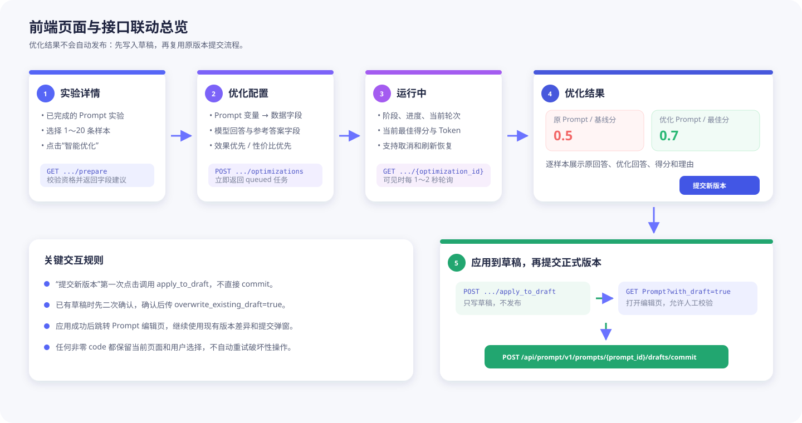

# 基于评测实验优化 Prompt：前端产品与接口实现文档

> 适用范围：GCS Loop「实验详情 → 智能优化 → 基于评测实验优化 Prompt」。
>
> 本文只定义前端页面、交互和接口调用；不要求修改现有 Prompt 编辑器与版本提交能力。
> 更完整的后端字段说明见 [evaluation-prompt-optimization-frontend-integration.md](./evaluation-prompt-optimization-frontend-integration.md)。

## 1. 最终要做成什么样

整体体验参考 Loop 官网，但 GCS Loop 只保留“基于评测实验优化 Prompt”这一条入口：

1. 用户从一个已成功完成的 Prompt 实验发起智能优化。
2. 选择 1～20 条实验样本。
3. 配置 Prompt 变量映射、模型回答字段、参考答案字段和优化模式。
4. 后端异步执行多轮“生成候选 Prompt → 运行样本 → 原评估器重评 → 保留最佳候选”。
5. 结果页展示原 Prompt 与优化 Prompt、汇总得分、逐样本回答和评分理由。
6. 用户点击“提交新版本”后，先将优化结果写入当前用户草稿。
7. 前端跳转到原 Prompt 编辑器，用户检查草稿并通过已有版本提交弹窗正式发布。

优化任务不会自动改写正式版本，也不会绕过现有版本控制。

### 官网结果页参考


官网结果页的必要信息层级是：

- 顶部：任务名称、下载、提交新版本；
- 汇总区：源版本、基线得分、优化后得分；
- Prompt 区：原 Prompt 与优化 Prompt 的结构化对比；
- 数据区：总样本数、上升/下降/不变数量；
- 明细区：变量、参考答案、原回答、优化回答、两侧评分和评分理由。

### GCS Loop 页面与接口联动图



## 2. 接口地址与统一约定

当前部署地址：

```text
http://172.18.36.230:8082
```

浏览器同源部署时，建议继续走前端已有 `/promptApi` 反向代理；直连后端时使用上述 Base URL。不要把 IP 写死在组件中，应由前端运行时配置统一提供。

所有 `/api/**` 接口使用当前登录会话的 `session_key` Cookie：

```ts
fetch(url, {
  credentials: 'include',
});
```

统一响应包络：

```ts
interface BaseResponse {
  code: number;
  msg: string;
}
```

- `code === 0` 才代表业务成功；不能只检查 HTTP 200。
- 所有 ID 都按 `string` 处理，禁止转换为 JavaScript `number`。
- 时间字段为毫秒时间戳字符串。

## 3. 前端路由建议

推荐沿用官网的信息架构：

```text
/evaluation/experiments/:exptId
  └─ 实验详情和“智能优化”入口

/evaluation/experiments/:exptId/prompt-optimization/new
  └─ 样本选择和优化配置

/pe/prompts/:promptId/optimization/:optimizationId
  └─ 运行进度或最终结果页

/pe/prompts/:promptId
  └─ 已有 Prompt 编辑器，加载应用后的草稿并提交版本
```

刷新优化页时，只依赖 URL 中的 `exptId`、`promptId`、`optimizationId` 重新查询，不依赖路由内存状态。

## 4. 页面一：实验详情的“智能优化”入口

### 4.1 页面加载

实验已完成时调用：

```http
GET /api/evaluation/v1/experiments/{expt_id}/prompt_optimizations/prepare?workspace_id={workspace_id}
```

前端按响应控制入口：

```ts
if (response.code !== 0 || !response.eligible) {
  disableOptimizeButton();
  showReason(response.ineligible_reason || response.msg);
}
```

`eligible=true` 时，缓存以下配置页元数据：

- `prompt_id`、`prompt_key`、`prompt_name`；
- `source_prompt_version`；
- `prompt_variables`；
- `dataset_fields`、`target_output_fields`；
- 三个 `suggested_*` 字段；
- `mode_options`；
- `max_sample_count`、`default_sample_count`。

### 4.2 入口交互

右上角按钮文案建议为“智能优化”。点击后只显示一个能力卡片：

```text
基于评测实验优化 Prompt
使用本次实验的样本、模型回答和评估器，迭代生成更优 Prompt。
```

不要展示“根据需求生成 Prompt”等未实现入口。

## 5. 页面二：选择样本与优化配置

### 5.1 获取实验结果行

复用现有实验结果接口：

```http
POST /api/evaluation/v1/experiments/results/batch_get?workspace_id={workspace_id}&page_number=1&page_size=20
Content-Type: application/json

{
  "experiment_ids": ["{expt_id}"]
}
```

选择器规则：

- 最少 1 条，最多使用 `prepare.max_sample_count`，当前上限为 20；
- 每条提交 `item_id` 和可选 `turn_id`；
- 不允许重复选择同一 `(item_id, turn_id)`；
- 前端只提交标识，样本内容由后端重新读取，不把整行结果回传给创建接口。

### 5.2 配置项

| 区域 | 数据来源 | 前端要求 |
|---|---|---|
| Prompt 版本 | `source_prompt_version` | 只读展示 |
| Prompt 变量 | `prompt_variables` | 每个变量必须映射一个数据集字段 |
| 数据集字段 | `dataset_fields` | 下拉选项 |
| 模型回答字段 | `target_output_fields` | 可使用建议值初始化 |
| 参考答案字段 | `dataset_fields` | 可选，可清空 |
| 优化模式 | `mode_options` | 默认 `effect_first` |
| 最大轮数 | 模式默认值 | 1～20 |

模式文案：

- `effect_first`：效果优先，默认最多 8 轮；
- `cost_effective`：性价比优先，默认最多 3 轮。

### 5.3 创建任务

```http
POST /api/evaluation/v1/experiments/{expt_id}/prompt_optimizations
Content-Type: application/json

{
  "workspace_id": "7670078211023175681",
  "samples": [
    { "item_id": "10001", "turn_id": "20001" },
    { "item_id": "10002", "turn_id": "20002" }
  ],
  "variable_mappings": {
    "user_query": "question"
  },
  "model_answer_field": "actual_output",
  "reference_answer_field": "reference_output",
  "mode": "effect_first",
  "max_iterations": 8,
  "name": "提示词优化实验0.0.1_优化",
  "idempotency_key": "b29c4d75-3665-4474-9ad5-24166069a84e"
}
```

`idempotency_key` 在用户每次点击“开始优化”时生成一个 UUID。同一次请求因超时或网络错误重试时必须复用原值；用户修改配置后再次启动时生成新值。

成功后立即跳转：

```text
/pe/prompts/{task.prompt_id}/optimization/{task.id}?expt_id={expt_id}
```

## 6. 页面三：运行进度

### 6.1 查询接口

运行中使用轻量查询：

```http
GET /api/evaluation/v1/experiments/{expt_id}/prompt_optimizations/{optimization_id}?workspace_id={workspace_id}&with_iterations=true&with_sample_results=false
```

轮询策略：

- 页面可见且状态为 `queued`/`running`：每 1～2 秒一次；
- 页面隐藏：暂停或降为 10 秒一次；
- `succeeded`、`failed`、`canceled`：立即停止；
- 网络错误采用 2、4、8 秒退避，最多 30 秒，不能新建任务；
- 刷新页面后重新 GET 即可恢复。

### 6.2 状态展示

| status | 页面状态 |
|---|---|
| `queued` | 等待执行，显示排队状态 |
| `running` | 显示阶段、进度和轮次 |
| `succeeded` | 加载完整结果页 |
| `failed` | 显示 `error_message` 和返回实验入口 |
| `canceled` | 显示已取消，不再轮询 |

| stage | 中文文案 |
|---|---|
| `preparing` | 准备 Prompt 与实验数据 |
| `analyzing` | 分析原始回答与评估结果 |
| `optimizing` | 生成候选 Prompt |
| `evaluating` | 运行候选 Prompt 并重新评估 |
| `finalizing` | 汇总最佳结果 |
| `completed` | 优化完成 |

进度条直接使用 `task.progress`，范围 0～100。运行页可展示：

- 当前 `stage`；
- `iterations.length / max_iterations`；
- `best_metrics.average_score`；
- `best_metrics.input_tokens + output_tokens`；
- 取消按钮。

### 6.3 取消任务

```http
POST /api/evaluation/v1/experiments/{expt_id}/prompt_optimizations/{optimization_id}/cancel
Content-Type: application/json

{
  "workspace_id": "7670078211023175681"
}
```

点击取消前显示确认框。成功后以响应中的 `task.status` 覆盖本地状态；不要乐观写死为 `canceled`。

## 7. 页面四：优化结果

进入终态后请求一次完整数据：

```http
GET /api/evaluation/v1/experiments/{expt_id}/prompt_optimizations/{optimization_id}?workspace_id={workspace_id}&with_iterations=true&with_sample_results=true
```

### 7.1 顶部汇总

| UI | 字段 |
|---|---|
| 对比版本 | `task.source_prompt_version` |
| 优化前得分 | `task.baseline_metrics.average_score` |
| 优化后得分 | `task.best_metrics.average_score` |
| 全部回答 | `task.best_metrics.sample_count` |
| 评分上升 | `task.best_metrics.improved_count` |
| 评分下降 | `task.best_metrics.regressed_count` |
| 评分不变 | `task.best_metrics.unchanged_count` |
| Token | `input_tokens`、`output_tokens` |

得分没有提升时必须如实显示，不把任务包装为“优化成功”；建议提示“已完成搜索，但没有发现优于原版本的候选 Prompt”。

### 7.2 Prompt 对比

- 左侧使用 `original_prompt_template.messages`；
- 右侧使用 `optimized_prompt_template.messages`；
- 按消息顺序和 `role` 分块；
- 文本 Diff 在浏览器本地计算；
- 变量 `{{variable}}` 保持独立样式，不做字符串替换；
- 不能直接渲染后端文本为 HTML。

推荐用现有 Prompt Diff 组件；不要把整份 Prompt 合并成一个字符串后再比较。

### 7.3 样本对比表

表格列建议：

| 列 | 字段 |
|---|---|
| 输入变量 | `sample.variables` |
| 参考答案 | `reference_answer` |
| 优化前模型回答 | `original_answer` |
| 优化后模型回答 | `optimized_answer` |
| 优化前综合得分 | `original_score` |
| 优化后综合得分 | `optimized_score` |
| 评估器明细 | 两组 evaluator scores/reasons |
| 变化 | `optimized_score - original_score` |

完整样本数据位于最佳候选对应的 `iterations[].sample_results`。前端先按 `metrics.average_score` 选择最高分轮次；若最高分仍低于或等于基线且最终 `optimized_prompt_template` 等于原模板，则展示“无更优候选”，不要把较差候选当成最终优化结果。

### 7.4 历史任务

如果实验详情需要展示历次优化记录：

```http
POST /api/evaluation/v1/experiments/{expt_id}/prompt_optimizations/list
Content-Type: application/json

{
  "workspace_id": "7670078211023175681",
  "page_number": 1,
  "page_size": 20,
  "statuses": ["succeeded", "failed"]
}
```

响应包含 `tasks` 和字符串形式的 `total`。

## 8. “提交新版本”的准确实现

这是本功能最重要的接口边界。

结果页按钮可以沿用官网文案“提交新版本”，但按钮点击后的第一次写操作是“应用到草稿”，不是直接发布。

### 8.1 点击前检查当前草稿

先读取 Prompt：

```http
GET /api/prompt/v1/prompts/{prompt_id}?workspace_id={workspace_id}&with_draft=true&with_commit=true
```

- 没有 `prompt_draft`：直接以 `overwrite_existing_draft=false` 应用；
- 已有 `prompt_draft`：弹出覆盖确认框；
- 用户取消：留在结果页，不发写请求；
- 用户确认：使用 `overwrite_existing_draft=true`。

覆盖确认文案：

```text
当前 Prompt 已有未提交草稿。应用优化结果会覆盖该草稿，且无法从本页面恢复。
是否继续？
```

### 8.2 应用到草稿

```http
POST /api/evaluation/v1/experiments/{expt_id}/prompt_optimizations/{optimization_id}/apply_to_draft
Content-Type: application/json

{
  "workspace_id": "7670078211023175681",
  "overwrite_existing_draft": false
}
```

成功响应：

```json
{
  "prompt_id": "7590116429134035714",
  "source_prompt_version": "0.0.1",
  "draft_base_version": "0.0.1",
  "next_action": "open_prompt_editor_and_submit_new_version",
  "code": 0,
  "msg": ""
}
```

如果检查后到写入前另一标签页新建了草稿，第一次请求仍可能返回非零业务错误。此时重新 GET Prompt，再让用户确认；禁止静默把请求改成 `overwrite_existing_draft=true`。

### 8.3 跳转编辑器

应用成功后跳转已有 Prompt 编辑页，并重新 GET：

```http
GET /api/prompt/v1/prompts/{prompt_id}?workspace_id={workspace_id}&with_draft=true&with_commit=true
```

编辑器应显示：

- Prompt Template 已替换为优化结果；
- 模型配置、工具、MCP、参数等仍来自源版本；
- 页面状态为“修改未提交”；
- 用户仍可手动修改草稿。

### 8.4 正式提交版本

用户在已有版本弹窗中填写版本号、描述和标签，调用原接口：

```http
POST /api/prompt/v1/prompts/{prompt_id}/drafts/commit
Content-Type: application/json

{
  "commit_version": "0.0.2",
  "commit_description": "基于评测实验优化",
  "label_keys": []
}
```

只有这个接口成功才算真正创建了新版本。提交时如遇现有版本冲突，继续复用 Prompt 模块已有的 `600501011` 冲突处理、重新 Diff 和用户确认流程。

## 9. 推荐前端状态模型

```ts
type OptimizationStatus =
  | 'queued'
  | 'running'
  | 'succeeded'
  | 'failed'
  | 'canceled';

type OptimizationStage =
  | 'preparing'
  | 'analyzing'
  | 'optimizing'
  | 'evaluating'
  | 'finalizing'
  | 'completed';

interface OptimizationPageState {
  loading: boolean;
  task?: PromptOptimizationTask;
  polling: boolean;
  applyingToDraft: boolean;
  canceling: boolean;
  error?: string;
}

interface PromptOptimizationTask {
  id?: string;
  workspace_id?: string;
  experiment_id?: string;
  prompt_id?: string;
  prompt_key?: string;
  source_prompt_version?: string;
  status?: OptimizationStatus;
  stage?: OptimizationStage;
  progress?: number;
  baseline_metrics?: PromptOptimizationMetrics;
  best_metrics?: PromptOptimizationMetrics;
  original_prompt_template?: PromptTemplate;
  optimized_prompt_template?: PromptTemplate;
  iterations?: PromptOptimizationIteration[];
  error_message?: string;
  applied_to_draft?: boolean;
}
```

生成的 API 类型是事实来源；上述类型只用于说明页面状态，不要在业务组件中复制一份可能漂移的完整 IDL。

## 10. 错误与边界处理

| 场景 | 前端处理 |
|---|---|
| `prepare.eligible=false` | 禁用入口并展示 `ineligible_reason` |
| 创建返回非零 code | 保留全部选择和映射，允许修改后重试 |
| 创建请求超时 | 使用同一 `idempotency_key` 重试 |
| 轮询网络错误 | 退避重试，不创建新任务 |
| `task.status=failed` | 展示 `error_message`，保留任务详情入口 |
| `task.status=canceled` | 停止轮询，隐藏应用按钮 |
| 已有草稿 | 用户明确确认后才能覆盖 |
| `apply_to_draft` 成功 | 跳 Prompt 编辑器，不显示“发布成功” |
| 正式提交冲突 | 复用已有版本冲突处理 |

当前后端明确不支持：

- 带 snippet 的 Prompt 模板优化；
- 使用异步 Agent 评估器的实验；
- 另一条“基于需求描述生成 Prompt”的智能优化入口。

页面遇到这些情况时展示后端 `ineligible_reason`，不要自行降级成不等价流程。

## 11. API 清单

| 用途 | Method | Path |
|---|---|---|
| 优化资格和配置 | GET | `/api/evaluation/v1/experiments/{expt_id}/prompt_optimizations/prepare` |
| 实验样本列表 | POST | `/api/evaluation/v1/experiments/results/batch_get` |
| 创建优化任务 | POST | `/api/evaluation/v1/experiments/{expt_id}/prompt_optimizations` |
| 查询任务/结果 | GET | `/api/evaluation/v1/experiments/{expt_id}/prompt_optimizations/{optimization_id}` |
| 历史任务 | POST | `/api/evaluation/v1/experiments/{expt_id}/prompt_optimizations/list` |
| 取消任务 | POST | `/api/evaluation/v1/experiments/{expt_id}/prompt_optimizations/{optimization_id}/cancel` |
| 应用到草稿 | POST | `/api/evaluation/v1/experiments/{expt_id}/prompt_optimizations/{optimization_id}/apply_to_draft` |
| 读取草稿 | GET | `/api/prompt/v1/prompts/{prompt_id}` |
| 正式提交版本 | POST | `/api/prompt/v1/prompts/{prompt_id}/drafts/commit` |

六个优化专用接口与相关结构已出现在：

```text
http://172.18.36.230:8082/api-docs
http://172.18.36.230:8082/api-docs/openapi.json
```

## 12. 联调验收清单

- [ ] 未完成或非 Prompt 实验不能发起优化，并展示原因。
- [ ] 最多选择 20 条样本，重复样本被前端阻止。
- [ ] 所有 Prompt 变量都有字段映射才允许启动。
- [ ] 双击“开始优化”不会创建两个任务。
- [ ] 刷新运行页后任务状态和进度可恢复。
- [ ] 页面不可见时不会持续高频轮询。
- [ ] 完成页正确展示原/优化 Prompt、汇总分和逐样本结果。
- [ ] 得分未提升时不显示误导性的成功文案。
- [ ] 点击“提交新版本”不会直接调用 `drafts/commit`。
- [ ] 已有草稿时必须二次确认；取消后草稿不变。
- [ ] 应用成功后编辑器能加载优化草稿，正式版本尚未增加。
- [ ] 最终调用 `drafts/commit` 成功后，版本历史才出现新版本。
- [ ] 所有 ID 始终是字符串，未发生精度丢失。
- [ ] 所有非零业务 `code` 都有明确错误提示并保留用户上下文。
