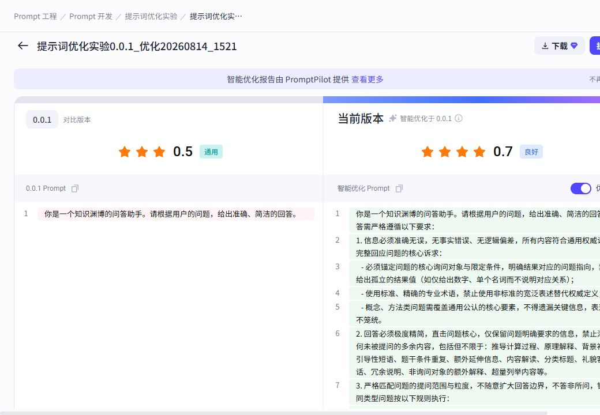

# 基于评测实验优化 Prompt：前端页面规范

接口字段和完整请求示例见 [evaluation-prompt-optimization-frontend-integration.md](./evaluation-prompt-optimization-frontend-integration.md)。本页面规范只覆盖 GCS Loop 已实现的“基于评测实验优化 Prompt”，不展示其他优化入口。

## 1. 页面流程

```text
成功的 Prompt 评测实验
  → 智能优化
  → 选择 20～500 条实验结果
  → 映射 Prompt 变量、参考答案和实际输出
  → 资源预估确认
  → 创建优化任务
  → 运行进度/结果页
  → 提交新版本（先 drafts/save）
  → Prompt 编辑器确认
  → drafts/commit 正式创建版本
```

官网结果页的信息层级可参考：



## 2. 页面与接口

| 页面 | 接口 | 要求 |
|---|---|---|
| 实验选择 | 复用实验列表、实验详情、实验结果接口 | 只显示成功完成、目标为当前 Prompt 版本且有评估器的实验 |
| 参数配置 | `POST .../optimize_tasks/evaluate` | 样本 20～500；映射全部 Prompt 变量；不能全选满分样本 |
| 启动任务 | `POST .../optimize_tasks` | 请求参数与预估保持一致，并带回资源预估值 |
| 运行/结果 | `POST .../optimize_tasks/{task_id}` | `Created`/`Running` 每 2 秒轮询，终态停止 |
| 终止任务 | `POST .../optimize_tasks/{task_id}/terminate` | 仅运行中或等待中的任务显示；成功后按 `Terminated` 终态展示 |
| Prompt 的“优化”标签 | `POST .../optimize_tasks/list` | 使用 Prompt 级任务列表，显示正在运行和历史任务 |
| 应用结果 | `POST .../drafts/save` | 用户明确点击后才把优化消息保存为草稿，不自动发布 |
| 正式发布 | `POST .../drafts/commit` | 继续使用已有版本提交弹窗和冲突处理 |

五个优化接口的共同前缀：

```text
/api/prompt/v1/prompts/{prompt_id}/optimize_tasks
```

禁止再调用旧 `/api/evaluation/v1/experiments/{expt_id}/prompt_optimizations/**` 路径。

## 3. 创建页

### 第一步：选择实验数据

- 表格展示实验结果原有字段、模型实际输出、评估器得分和理由。
- 默认不自动勾选；选择不足 20 条时禁用“下一步”。
- 最多 500 条；只向后端提交 `item_id`。
- 如果已选样本全部满分，提示“请选择包含改进空间的数据”。

### 第二步：配置字段映射

- `eval_set_to_target`：左侧评测集字段，右侧 Prompt 变量；必须完整覆盖所有变量。
- `eval_set_to_reference`：可选参考答案字段。
- `eval_set_to_actual_output`：必选实验实际输出字段。
- `optimize_factor`：0～1，默认 0.5；可展示为效果/成本倾向滑杆。
- `engine` 固定 `Ark`，`optimize_task_type` 固定 `Score`，无需让用户选择。

点击“开始优化”时先调用 `evaluate`。预估成功后显示模型调用量范围，用户确认后再调用创建接口。

## 4. 运行页

状态文案：

| status | 文案 |
|---|---|
| `Created` | 等待执行 |
| `Running` | 优化进行中 |
| `Success` | 优化完成 |
| `Failed` | 优化任务失败 |
| `Terminated` | 优化已终止 |

运行时展示 `progress`、`stage`，并使用详情接口在 `Running` 状态返回的部分 `optimize_result` 实时刷新当前最佳 Prompt、指标、已完成迭代和 Token。任务刚启动且 `optimize_result` 为空时继续轮询。页面隐藏时暂停轮询；网络失败使用退避重试，不能重复创建任务。

## 5. 结果页

- 左侧展示源 Prompt，右侧展示 `optimize_result.optimized_prompt_message_list`。
- 使用现有结构化 Prompt Diff 组件，不把 Prompt 拼成 HTML。
- 展示 `baseline_metrics` 与 `best_metrics`，以及每轮 `iterations` 和样本级评分变化。
- 没有优于基线时如实提示“任务已完成，未找到更优候选”，不能伪装成提升成功。
- 只有 `status === 'Success'` 且存在优化消息时显示“提交新版本”。

“提交新版本”按钮并不直接发布：

1. 读取源版本完整 Prompt 配置。
2. 仅以优化后的消息/工具替换对应草稿字段，保留模型、MCP 和其他配置。
3. 调用 `drafts/save`。
4. 跳转 Prompt 编辑器，用户检查或继续编辑。
5. 用户在原版本弹窗调用 `drafts/commit` 后，才显示发布成功。

## 6. Prompt 详情“优化”标签

页面进入或 Prompt ID 改变时调用：

```http
POST /api/prompt/v1/prompts/{prompt_id}/optimize_tasks/list

{
  "workspace_id": "7670078211023175681",
  "page_num": 1,
  "page_size": 20
}
```

列表使用 `optimize_tasks`，分页总数使用 `total`。点击一项跳转：

```text
/pe/prompts/{prompt_id}/optimization/{task_id}
```

## 7. 联调验收

- [ ] Swagger 只显示五个 `optimize_tasks` 接口，无旧 `prompt_optimizations` 路由。
- [ ] 选择少于 20 条或超过 500 条不能创建任务。
- [ ] 参数映射缺失时保留页面输入并展示后端错误。
- [ ] 创建后能立即进入任务页，刷新后仍能恢复状态。
- [ ] `Created`/`Running` 正确轮询，终态停止。
- [ ] `Created`/`Running` 可终止，接口返回后立即展示 `Terminated` 并停止轮询。
- [ ] Prompt “优化”标签能看到当前 Prompt 的运行中与历史任务。
- [ ] 优化完成不会自动修改草稿或版本。
- [ ] 点击“提交新版本”先保存草稿，再由用户通过已有版本接口发布。
- [ ] 所有 ID 在前端始终按字符串处理。
