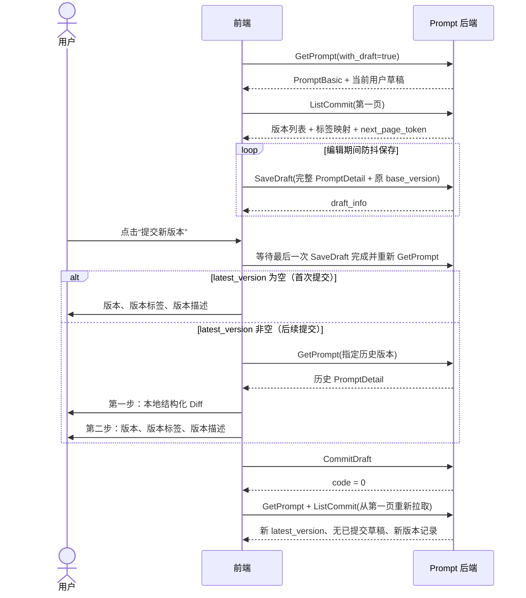

# Prompt 草稿、提交、版本对比与恢复：前端接入指南

本文定义 GCS Loop Prompt 从草稿到版本提交的前后端契约，交互目标与 `loop.coze.cn` 保持一致：首次提交直接填写版本信息；后续提交先确认版本差异，再填写版本信息；版本记录支持分页查看、对比和恢复。

本次只增强后端契约，不修改前端，也不新增专用 Diff API。版本差异由前端基于后端返回的结构化 `PromptDetail` 在本地计算和展示。

## 0. 接入结论：现有版本控制页面不需要重做

GCS Loop 前端原本已经包含“提交新版本”的两步弹窗、Prompt Diff、版本记录和历史版本恢复组件；本次改动是在保持原 endpoint 和成功响应兼容的前提下补强后端事务与错误语义。正常提交路径不增加任何新调用。

前端最小调用清单：

| 场景 | 调用 | 本次是否新增 |
| --- | --- | --- |
| 打开编辑页 | `GET /api/prompt/v1/prompts/{prompt_id}?with_draft=true&with_commit=true` | 原有 |
| 加载版本列表 | `POST /api/prompt/v1/prompts/{prompt_id}/commits/list?with_commit_detail=true` | 原有 |
| 编辑中自动保存 | `POST /api/prompt/v1/prompts/{prompt_id}/drafts/save` | 原有 |
| 首次提交 | 直接展示版本、标签、描述后调用 `POST .../drafts/commit` | 原有 |
| 后续提交 | 使用 GetPrompt/ListCommit 返回的数据在前端本地 Diff，再调用同一个 `POST .../drafts/commit` | 原有 |
| 提交成功 | 清空版本游标，重新调用 GetPrompt 和 ListCommit 第一页 | 原有 |
| 草稿并发冲突 | 仅当 `code=600501011` 时重新调用 GetPrompt；用户确认 rebase 后复用 SaveDraft | 本次新增处理分支，无新 endpoint |
| 恢复历史版本 | `POST .../drafts/revert_from_commit`，随后重新调用 GetPrompt | 原有 |

因此前端不应重新开发截图中的提交版本控制页面。若当前页面已经能正常完成两步提交，必做的适配只有：统一读取业务错误 `extra`、识别 `600501011`，并确保分页 token 原样透传。其余幂等、事务、主从一致性和数据库保护均由后端透明完成。

## 1. 前后端职责

| 能力 | 后端职责 | 前端职责 |
| --- | --- | --- |
| 草稿 | 持久化当前登录用户的个人草稿 | 编辑、自动保存、提交前等待保存完成 |
| 首次提交 | 校验版本并把个人草稿原子提交为首个版本 | 展示版本、版本标签、版本描述三个输入项 |
| 后续提交 | 校验并发基线、创建新版本、删除已提交草稿 | 第一步展示结构化 Diff，第二步收集版本信息 |
| 版本 Diff | 提供草稿、历史版本详情和版本列表 | 本地计算并渲染 Diff，不把 Diff 结果回传后端 |
| 版本历史 | 提供稳定游标分页、版本元数据、标签映射 | 无限滚动、选择版本、打开对比 |
| 恢复版本 | 将指定历史版本复制为当前用户的新草稿 | 二次确认，恢复后重新拉取草稿并进入编辑态 |
| 并发保护 | 检测提交期间版本或草稿变化 | 收到冲突后重新拉取并要求用户明确确认，禁止自动 rebase |
| 提交重试 | 以提交版本作为自然幂等键识别相同重试 | 网络结果不确定时原样重试同一个请求对象 |

## 2. 通用约定

- Web 端接口均以 `/api` 开头，使用登录后的 `session_key` Cookie；跨域请求必须设置 `credentials: 'include'`。
- 成功响应为 `code = 0`。业务错误通常仍使用 HTTP 200，前端必须检查响应体中的 `code`，不能只检查 HTTP 状态码。
- `prompt_id`、`workspace_id` 等 `i64` 字段在 JSON 中是字符串，前端不要转换为 JavaScript `number`。
- `created_at`、`updated_at`、`committed_at` 是毫秒时间戳字符串。
- 请求和响应字段使用 snake_case。
- 错误 `msg` 可能按登录用户语言本地化，只用于展示；程序分支应使用 `code` 和结构化 `extra`。
- 在线 Swagger：`/api-docs`；OpenAPI JSON：`/api-docs/openapi.json`。

通用成功响应：

```json
{
  "code": 0,
  "msg": ""
}
```

通用业务错误响应：

```json
{
  "code": 600500202,
  "msg": "invalid param"
}
```

部分可恢复错误会额外返回顶层 `extra`，具体见“并发冲突处理”。

`extra` 由统一 HTTP 响应适配层加入业务错误包络，不属于各 endpoint 的成功 DTO。若生成的 TypeScript 成功响应类型暂未声明它，应在公共请求/错误拦截层把错误统一建模为 `{ code: number; msg: string; extra?: Record<string, string> }`，不要把 `extra` 错加到 `CommitDraft` 的成功响应类型中。

## 3. 页面状态与总体调用时序



提交接口不接收编辑器内容。它提交的是服务端已经保存的“当前登录用户草稿”，所以提交前必须先等待最后一次 `SaveDraft` 成功。

路径中的 `prompt_id` 足以让后端确定工作空间，因此 `SaveDraft`、`ListCommit`、`CommitDraft` 和 `RevertDraftFromCommit` 的 body 都没有 `workspace_id`。`GetPrompt` 的 `workspace_id` 是可选归属校验；标签列表及标签更新接口则按各自 IDL 明确要求 `workspace_id`。

## 4. 接口定义

### 4.1 获取 Prompt、当前草稿或指定版本

```http
GET /api/prompt/v1/prompts/{prompt_id}
```

Query 参数：

| 参数 | 类型 | 必填 | 说明 |
| --- | --- | --- | --- |
| `workspace_id` | string | 建议传 | 当前工作空间 ID |
| `with_draft` | boolean | 否 | 返回当前登录用户的个人草稿 |
| `with_commit` | boolean | 否 | 返回提交版本 |
| `commit_version` | string | 否 | `with_commit=true` 时指定版本；省略时后端默认读取 `latest_version`，对比场景建议明确传入以固定基准 |
| `with_default_config` | boolean | 否 | 是否附带默认配置 |
| `expand_snippet` | boolean | 否 | 是否展开被引用的 Prompt 片段；Diff 的“展开嵌套内容”开关使用 |

获取当前编辑草稿：

```http
GET /api/prompt/v1/prompts/7590116739450178818?workspace_id=7670078211023175681&with_draft=true
```

获取指定提交版本：

```http
GET /api/prompt/v1/prompts/7590116739450178818?workspace_id=7670078211023175681&with_commit=true&commit_version=1.0.0
```

代表性响应：

```json
{
  "prompt": {
    "id": "7590116739450178818",
    "workspace_id": "7670078211023175681",
    "prompt_key": "bidding_proposal_writing",
    "prompt_basic": {
      "display_name": "招标方案撰写",
      "description": "根据招标要求撰写方案",
      "latest_version": "1.0.0",
      "created_by": "10001",
      "updated_by": "10001",
      "created_at": "1786377600000",
      "updated_at": "1786377700000",
      "latest_committed_at": "1786377700000",
      "prompt_type": "normal",
      "security_level": "L1"
    },
    "prompt_draft": {
      "detail": {
        "prompt_template": {
          "template_type": "normal",
          "messages": [
            {
              "role": "system",
              "content": "你是一名资深 IT 售前解决方案专家。"
            },
            {
              "role": "user",
              "content": "招标需求：{{tender_requirements}}"
            }
          ],
          "variable_defs": [
            {
              "key": "tender_requirements",
              "desc": "招标需求与评分标准",
              "type": "string"
            }
          ],
          "has_snippet": false,
          "metadata": {}
        },
        "tools": [],
        "tool_call_config": {
          "tool_choice": "auto"
        },
        "model_config": {
          "model_id": "123456789",
          "max_tokens": 4096,
          "temperature": 0,
          "top_k": 1,
          "top_p": 0.001,
          "presence_penalty": 0,
          "frequency_penalty": 0,
          "json_mode": false
        },
        "ext_infos": {}
      },
      "draft_info": {
        "user_id": "10001",
        "base_version": "1.0.0",
        "is_modified": true,
        "created_at": "1786377650000",
        "updated_at": "1786377720000"
      }
    }
  },
  "code": 0,
  "msg": ""
}
```

当请求 `with_commit=true` 时，对应内容位于 `prompt.prompt_commit`：

```json
{
  "prompt_commit": {
    "detail": {
      "prompt_template": {},
      "tools": [],
      "model_config": {}
    },
    "commit_info": {
      "version": "1.0.0",
      "base_version": "0.0.1",
      "description": "调整输出结构",
      "committed_by": "10001",
      "committed_at": "1786377700000"
    }
  }
}
```

说明：

- `with_draft=true` 只返回当前登录用户的草稿，不会返回其他用户的草稿。
- `with_commit=true` 且不传 `commit_version` 时，后端先读取 `prompt_basic.latest_version` 并返回该版本；首次提交前没有最新版本时不会返回 `prompt_commit`。
- `prompt_basic.latest_version` 是当前最新已提交版本，是判断首次/后续提交的唯一依据。
- `draft_info.base_version` 表示当前草稿内容源自哪个版本；它与后端内部并发基线不是同一个概念。
- 后端内部并发基线不会出现在正常 `GetPrompt` 响应中，只会在冲突错误的 `extra.draft_expected_latest_version` 中暴露给排障和交互判断。

### 4.2 保存草稿

```http
POST /api/prompt/v1/prompts/{prompt_id}/drafts/save
Content-Type: application/json
```

请求：

```json
{
  "prompt_draft": {
    "detail": {
      "prompt_template": {
        "template_type": "normal",
        "messages": [
          {
            "role": "system",
            "content": "你是一名资深 IT 售前解决方案专家。"
          }
        ],
        "variable_defs": [],
        "has_snippet": false,
        "metadata": {}
      },
      "tools": [],
      "tool_call_config": {
        "tool_choice": "auto"
      },
      "model_config": {
        "model_id": "123456789",
        "max_tokens": 4096,
        "temperature": 0
      },
      "ext_infos": {}
    },
    "draft_info": {
      "base_version": "1.0.0"
    }
  }
}
```

响应：

```json
{
  "draft_info": {
    "user_id": "10001",
    "base_version": "1.0.0",
    "is_modified": true,
    "created_at": "1786377650000",
    "updated_at": "1786377720000"
  },
  "code": 0,
  "msg": ""
}
```

前端规则：

- `SaveDraft` 是完整草稿保存，不是 JSON Merge Patch；必须发送当前完整 `PromptDetail`，不能只发送发生变化的消息或配置项。
- 普通自动保存建议原样携带当前草稿的 `base_version`。不要在每次自动保存时把它改成 `latest_version`，否则相当于未经用户确认进行了 rebase。
- 兼容旧客户端：已有草稿的持久化 `base_version` 非空时，如果请求省略 `draft_info.base_version` 或显式传 `""`，后端会保留原 `base_version` 和原 `expected_latest_version`，响应也返回原 `base_version`。空值不表示“清空来源版本”，也不表示 rebase。
- 显式 rebase 必须发送当前最新且非空的 `latest_version`，并且它要与草稿当前持久化的 `base_version` 不同；只有这个明确的 base 变化才会重建并发基线。
- 新建草稿没有可继承的 base：此时省略或传空会保存空 `base_version`，但内部 `expected_latest_version` 仍捕获创建当时的最新提交版本。
- `user_id` 由会话决定，`is_modified` 和时间字段由后端计算；前端不应自行伪造。
- 防抖保存要串行化或取消旧请求，提交前必须 flush 并等待最后一个保存请求完成。
- 即使内容没有变化，后端也会返回已有的完整 `draft_info`，前端可安全刷新草稿状态。

### 4.3 获取版本历史

```http
POST /api/prompt/v1/prompts/{prompt_id}/commits/list?with_commit_detail=true
Content-Type: application/json
```

第一页请求（必须省略 `page_token`）：

```json
{
  "page_size": 20,
  "asc": false
}
```

下一页请求才携带上一页返回的 token：

```json
{
  "page_size": 20,
  "page_token": "lc1.<opaque>",
  "asc": false
}
```

`asc=false` 表示按提交时间和内部提交 ID 倒序，新提交在前。这里不是按版本号字符串排序。

响应：

```json
{
  "prompt_commit_infos": [
    {
      "version": "1.0.1",
      "base_version": "1.0.0",
      "description": "补充风险控制章节",
      "committed_by": "10001",
      "committed_at": "1786377800000"
    },
    {
      "version": "1.0.0",
      "base_version": "",
      "description": "首次发布",
      "committed_by": "10001",
      "committed_at": "1786377700000"
    }
  ],
  "commit_version_label_mapping": {
    "1.0.1": [
      { "key": "production" }
    ]
  },
  "prompt_commit_detail_mapping": {
    "1.0.1": {
      "prompt_template": {},
      "tools": [],
      "model_config": {}
    },
    "1.0.0": {
      "prompt_template": {},
      "tools": [],
      "model_config": {}
    }
  },
  "users": [
    {
      "user_id": "10001",
      "name": "张三"
    }
  ],
  "has_more": true,
  "next_page_token": "lc1.<opaque>",
  "code": 0,
  "msg": ""
}
```

分页规则：

- `page_size` 必须为 `1..200`，推荐使用 `20`；超过上限返回 `600500202`。
- 第一页必须省略 `page_token`。对该接口显式发送空字符串会被视为非法 token，返回 `600500202`。
- 新 token 当前以 `lc1.` 开头，内部绑定 `prompt_id`、`asc`、提交时间和内部提交 ID；这些属于实现细节。前端只能把整个 token 当作不透明字符串原样保存和回传，不得解析、构造或修改。
- token 只能用于生成它的同一 `prompt_id` 和同一 `asc` 方向；不匹配时返回 `600500202`。
- 后端使用 `created_at + commit_id` 的严格 keyset 边界；从新 token 开始，即使多个版本在同一秒创建也不会跨页重复或遗漏。
- 新后端仍接受旧版“正整数 Unix 秒”token，并在响应中换发新 token。旧 token 使用一次旧的包含式时间边界，迁移这一页可能出现边界重复；前端合并列表时应按 `version` 去重，此后的新 token 分页是稳定的。该兼容是单向的：旧后端不认识新后端签发的 `lc1.*` token。Docker Compose 发布时必须整体重建并重启后端，不能让同一次分页请求在新旧实例之间切换；若未来改成多实例滚动发布，需要采用“两阶段双读、先继续签发旧 token，待全量升级后再签发新 token”的发布策略。
- 下一页必须使用上一页响应的 `next_page_token`。只有 `has_more=true` 时才会同时返回 `next_page_token`；没有更多数据时这两个可选字段可能直接缺失，前端应把缺失的 `has_more` 当作 `false`。
- `prompt_id` 或 `asc` 变化时，清空旧 token 并从第一页重新加载。
- 不要把 token 长期持久化到 localStorage 或数据库；它只属于当前列表会话。
- `with_commit_detail=false` 可用于纯版本列表；需要直接在列表数据上做 Diff 时传 `true`，详情按版本放在 `prompt_commit_detail_mapping`。
- `commit_version_label_mapping` 是稀疏 map：没有标签的版本可能没有对应 key，前端按空数组处理。
- `parent_references_mapping` 只对 `prompt_type=snippet` 的 Prompt 填充，普通 Prompt 中通常缺失；没有 key 时按引用数 0 处理。
- 没有任何提交记录时，`prompt_commit_infos`、各类 map、`users` 和分页字段都可能缺失；前端分别归一化为 `[]`、`{}` 和 `false`。
- API 只返回已提交版本。若版本记录 UI 要显示“当前草稿”，由前端在第一页顶部插入一个本地伪条目，不能把它当成真实提交版本或分页游标的一部分。

### 4.4 提交当前草稿

```http
POST /api/prompt/v1/prompts/{prompt_id}/drafts/commit
Content-Type: application/json
```

请求：

```json
{
  "commit_version": "1.0.1",
  "commit_description": "补充风险控制章节",
  "label_keys": ["production", "stable"]
}
```

成功响应仅确认事务已完成，不返回新 Prompt：

```json
{
  "code": 0,
  "msg": ""
}
```

版本规则：

- 格式固定为 `a.b.c`，每段是 `0` 到 `9999` 的十进制整数，除数字 `0` 外不能有前导零。
- 首次提交至少为 `0.0.1`；前端默认值使用 `0.0.1`。
- 后续版本必须严格大于当前 `prompt_basic.latest_version`；前端可默认把 patch 位加一，但后端校验结果为准。
- `9999.9999.9999` 已是当前格式上限，不能再生成合法的更高版本；不要把 `10000.0.0` 提交给后端。
- `commit_description` 最多 200 个 Unicode 字符。
- `label_keys` 可省略；后端会按原始字符串排序、去重后处理，不会替前端 trim 或改写大小写。非预置标签必须已经通过标签创建接口持久化，否则返回 `600501001`。

事务语义：

- 后端提交的是当前会话用户已经持久化的草稿，不是请求体里的临时内容。
- 创建版本、更新 `latest_version`、绑定标签、复制片段引用关系和删除该用户草稿在同一个事务内完成。
- 第一次实际创建版本并返回 `code=0` 后，被提交的当前用户草稿已删除。若该响应是自然幂等重放，后端只确认原事务已经成功，不会再次执行删除等副作用；因此前端始终必须 refetch，不能仅靠本地乐观更新推断草稿状态。

提交成功后的固定 refetch：

1. 重新调用 `GetPrompt(with_draft=true)`，刷新 `prompt_basic.latest_version` 并确认草稿状态。
2. 清空版本列表 token，重新调用 `ListCommit` 第一页。
3. 若版本标签下拉或历史标签可见，刷新标签数据。
4. 以上请求成功后再关闭提交弹窗、选中新版本并提示成功。后端事务在返回前已提交，不要求固定 sleep；已有 UI 若保留短暂过渡延迟，也不能代替 refetch。

### 4.5 从历史版本恢复为草稿

```http
POST /api/prompt/v1/prompts/{prompt_id}/drafts/revert_from_commit
Content-Type: application/json
```

请求：

```json
{
  "commit_version_reverting_from": "1.0.0"
}
```

响应：

```json
{
  "code": 0,
  "msg": ""
}
```

语义：

- 将指定历史版本的完整 `PromptDetail` 复制为当前登录用户的新草稿；若该用户已有草稿，则覆盖其草稿。
- 不删除任何历史版本，不回退 `latest_version`，也不会自动发布。
- 恢复后的 `draft_info.base_version` 始终是被恢复的历史版本，用于保留版本来源；与此同时，后端会在 Prompt 行锁内按操作发生时的 `latest_version` 重新建立并发基线。即使目标版本与现有草稿的 `base_version` 相同，也会刷新已经落后的并发基线，因此用户确认恢复后可直接继续编辑和提交，不需要为了消除冲突把历史来源伪装成最新版本。只有恢复内容与并发基线都已经一致时，底层保存才可能是 no-op。
- 标签不随内容恢复。用户下一次提交时重新选择该新版本要绑定的标签。
- 恢复成功后必须调用 `GetPrompt(with_draft=true)` 获取真正的恢复草稿，不能继续把所选历史 `prompt_commit` 当作编辑态。
- 前端必须在调用前提示“将覆盖当前个人草稿”，并要求用户确认；成功后关闭版本记录面板并回到草稿编辑态。

### 4.6 标签辅助接口

提交弹窗的“版本标签”使用工作空间标签：

```http
POST /api/prompt/v1/labels/list
```

```json
{
  "workspace_id": "7670078211023175681",
  "label_key_like": "prod",
  "with_prompt_version_mapping": true,
  "prompt_id": "7590116739450178818",
  "page_size": 50
}
```

```json
{
  "labels": [
    { "key": "production" },
    { "key": "stable" }
  ],
  "prompt_version_mapping": {
    "production": "1.0.1",
    "stable": "1.0.0"
  },
  "has_more": false,
  "code": 0,
  "msg": ""
}
```

需要创建自定义标签时：

```http
POST /api/prompt/v1/labels
```

```json
{
  "workspace_id": "7670078211023175681",
  "label": {
    "key": "release_candidate"
  }
}
```

成功响应仍为 `{ "code": 0, "msg": "" }`。自定义 label key 只能包含小写英文字母、数字和下划线；与预置标签或已有自定义标签冲突时返回 `600501010`。

修改某个已提交版本的标签：

```http
POST /api/prompt/v1/prompts/{prompt_id}/commits/{commit_version}/labels_update
```

```json
{
  "workspace_id": "7670078211023175681",
  "label_keys": ["production", "stable"]
}
```

标签语义：

- 标签是工作空间内可复用的 key，但对同一个 Prompt，一个标签在同一时间只指向一个提交版本。
- 给新版本绑定已在该 Prompt 旧版本上的标签，会把该标签移动到新版本，而不是复制两份映射。
- `labels_update` 的 `label_keys` 表示该版本最终应拥有的完整标签集合；不在集合内的原标签会从该版本解除。
- 对 `labels_update` 传 `label_keys: []` 会解除该版本的全部标签。接口成功响应只有 `{code, msg}`，完成后应刷新版本标签映射。
- `prompt_version_mapping` 也是稀疏 map；未绑定到当前 Prompt 的标签没有对应 key。
- 提交表单应在最终确认处清楚显示标签当前指向的版本，避免用户无意移动生产标签。
- 标签列表和版本列表使用不同的游标格式，不能混用。标签 token 当前是十进制 ID 字符串（预置标签阶段也可能是负数），但对前端仍是 opaque string：第一页省略或传空字符串，下一页原样透传 `next_page_token`，不要解析或自行加减。

## 5. 首次提交与后续提交的前端分支

### 5.1 点击提交前的公共步骤

1. 停止或 flush 编辑器防抖保存。
2. 等待所有进行中的 `SaveDraft` 结束，禁止保存和提交并发发出。
3. 调用 `GetPrompt(with_draft=true)`，以服务端草稿作为提交弹窗的当前快照。
4. 读取 `prompt.prompt_basic.latest_version` 判断分支；不要用本地版本列表长度判断。

### 5.2 首次提交：单步表单

当 `latest_version` 为空字符串或字段缺失时，直接展示三个输入项：

1. **版本**：必填，默认 `0.0.1`。
2. **版本标签**：可选，可多选；显示标签当前映射版本。
3. **版本描述**：可选，最多 200 字。

首次提交不展示空白 Diff 步骤。确认后调用 `CommitDraft`，成功后执行固定 refetch。

### 5.3 后续提交：两步弹窗

当 `latest_version` 非空时，弹窗宽度可扩展为左右对比布局，并使用两步导航：

1. **确认版本差异**
   - 默认左侧版本为 `prompt_basic.latest_version`，右侧为当前草稿。
   - 左侧版本列表来自 `ListCommit`，允许用户选择其他历史版本作为查看基准。
   - 点击“继续”只切换到下一步，不调用提交接口。
   - 没有差异时显示空状态文案，但仍允许用户继续。
2. **确认版本信息**
   - 版本默认值为当前最新版本的 patch 位加一；patch 超过 `9999` 时向 minor 进位，minor 超过 `9999` 时向 major 进位。最终仍以服务端“严格大于最新版本”校验为准。
   - 展示版本标签与版本描述。
   - “上一步”返回 Diff，保留已填写的表单值。
   - “提交”调用 `CommitDraft`。

提交前看到的 Diff 只是用户确认界面，最终并发判定仍由后端在提交事务内完成。

## 6. 前端本地结构化 Diff

后端不新增 `/diff` 接口。前端分别取得“比较版本详情”和“当前草稿详情”，对两个 `PromptDetail` 做结构化比较。

### 6.1 数据获取

1. 当前侧：`GetPrompt(with_draft=true)` 的 `prompt.prompt_draft.detail`。
2. 基准侧：`GetPrompt(with_commit=true&commit_version={selectedVersion})` 的 `prompt.prompt_commit.detail`。
3. 版本选择列表：`ListCommit`；若已传 `with_commit_detail=true`，也可先使用 `prompt_commit_detail_mapping[selectedVersion]`，需要展开片段时再调用 `GetPrompt(expand_snippet=true)`。
4. 若前端现有模型 store 尚未加载模型名称，可调用已有辅助接口 `POST /api/llm/v1/models/list`，body 至少传 `{ "workspace_id": "<workspace_id>", "page_size": 100 }`，用响应 `models` 按模型 ID 补全配置 Diff 的展示名称。该接口不是提交所必需的，只有展示模型名称时才调用。

### 6.2 展示分组

与 Loop 的交互一致，至少分为两个页签并显示变化数量：

**Prompt 变化**

- `prompt_template.messages`：按消息顺序展示新增、删除、角色变化和内容行级 Diff；比较 `role`、`content`、`parts`、`metadata`。
- `prompt_template.metadata`：按 key 排序后格式化为 JSON，再做文本 Diff，避免对象键顺序造成假差异。
- `prompt_template.variable_defs`：以 `key` 为主键比较新增、删除以及类型、描述、type tags 变化。
- Prompt 片段：默认比较引用本身；打开“展开嵌套内容”后，以 `expand_snippet=true` 重新拉取两侧详情。

**配置变化**

- `model_config`：模型 ID、模型名称（通过模型列表补全展示）、`max_tokens`、`temperature`、`top_k`、`top_p`、presence/frequency penalty、JSON mode、thinking 与动态 `param_config_values`。
- `prompt_template.template_type`。
- `tool_call_config`。
- `tools` / 函数定义：对对象 key 稳定排序后比较。
- `mcp_config` 和产品当前支持展示的 `ext_infos` 配置。

### 6.3 比较规范

- 比较前统一把缺失数组视为 `[]`、缺失 map 视为 `{}`，避免 `undefined` 与空容器产生无意义差异。
- 不要忽略消息 `role`；`system` 与 `user` 内容相同也属于不同 Prompt。
- 数字 `0`、布尔值 `false` 不能按“空值”处理。
- Diff 结果仅用于渲染，不进入 `CommitDraft` 请求，也不应缓存为服务端事实。
- 基准版本默认是打开提交弹窗时重新获取的最新版本；版本列表中选其他版本只影响对比视图，不会改变草稿 `base_version`。

## 7. 并发冲突与版本占用处理

本次后端契约会在提交时保护两个并发窗口：

- 当前草稿建立基线后，其他用户提交了新版本。
- 应用层完成审核后、提交事务读取草稿前，自动保存又替换了草稿内容。

### 7.1 有草稿时，过期基线冲突优先

提交事务锁定 Prompt 后会同时读取最新版本和当前用户草稿。即使 `commit_version` 已被占用或已不再递增，只要草稿仍存在且其有效 `expected_latest_version` 落后于当前 `latest_version`，后端都会优先返回：

```json
{
  "code": 600501011,
  "msg": "prompt draft conflicts with the current version",
  "extra": {
    "conflict_type": "latest_version_changed",
    "draft_base_version": "1.0.0",
    "draft_expected_latest_version": "1.0.0",
    "latest_version": "1.0.1"
  }
}
```

因此两个用户基于 `1.0.0` 都准备提交 `1.0.1` 时，先完成事务的一方成功；后到一方的草稿仍以 `1.0.0` 为并发基线，所以收到 `600501011/latest_version_changed`，而不是版本已存在。

只有以下情况下，已存在的候选版本才返回 `600501009`：

- 当前用户仍有草稿，但其有效 `expected_latest_version` 已等于当前 `latest_version`，即基线并未落后。
- 当前用户已经没有草稿，并且该请求不满足第 8 节的严格自然幂等重放条件。

```json
{
  "code": 600501009,
  "msg": "prompt submit version already exist",
  "extra": {
    "commit_version": "1.0.1"
  }
}
```

前端收到 `600501009` 后仍应 refetch `GetPrompt(with_draft=true)` 与版本第一页，但它不代表草稿基线落后：

- 若草稿存在，保留草稿、重新展示当前 latest 的 Diff，并让用户输入严格更高且未占用的版本；不要因为 `600501009` 自动执行 rebase。
- 若草稿不存在，先判断是否只是未知结果重试；非幂等重复提交必须先重新保存草稿，才能创建新版本。

当候选版本不再严格大于最新版本、候选版本本身又不存在时：若现有草稿基线落后，仍优先返回 `600501011`；只有基线仍为最新或没有草稿时才返回 `600500202`。

### 7.2 结构化草稿冲突（600501011）

错误响应：

```json
{
  "code": 600501011,
  "msg": "prompt draft conflicts with the current version",
  "extra": {
    "conflict_type": "latest_version_changed",
    "draft_base_version": "1.0.0",
    "draft_expected_latest_version": "1.0.0",
    "latest_version": "1.0.1"
  }
}
```

`extra` 字段全部是字符串：

| 字段 | 说明 |
| --- | --- |
| `conflict_type` | `latest_version_changed`：最新提交版本变化；`draft_changed`：审核后的草稿内容又发生变化 |
| `draft_base_version` | 草稿内容的来源版本；历史恢复后可能明显早于最新版本 |
| `draft_expected_latest_version` | 草稿建立并发基线时观察到的最新提交版本 |
| `latest_version` | 提交事务读取到的权威最新版本 |

四个 key 在该冲突响应中都会返回；尚无版本时，对应的版本值可以是空字符串。

### 7.3 600501011 前端处理流程

处理步骤：

1. 保留提交弹窗和用户草稿，不清空编辑器，不提示“提交成功”。
2. 停止自动重试，等待当前自动保存队列结束。
3. 重新调用 `GetPrompt(with_draft=true)` 获取服务端当前草稿。
4. 用 `extra.latest_version` 或新响应的 `prompt_basic.latest_version` 获取最新提交详情。
5. 重新展示“最新版本 vs 当前草稿”的 Diff，并说明冲突原因。
6. **禁止自动 rebase。**若 `conflict_type=latest_version_changed`，只有用户明确点击“以当前草稿继续”后，才调用 `SaveDraft`：发送用户确认后的同一份完整 `detail`，并把 `draft_info.base_version` 设置为当前最新 `latest_version`。
7. 等待 `SaveDraft` 成功，重新刷新 Diff，把提交版本默认值重新计算为大于最新版本的值，再由用户点击提交。

显式 rebase 请求示例：

```json
{
  "prompt_draft": {
    "detail": {
      "prompt_template": {},
      "tools": [],
      "model_config": {}
    },
    "draft_info": {
      "base_version": "1.0.1"
    }
  }
}
```

必须用 refetch 后、用户确认过的完整 `detail` 替换示例中的占位内容。

对 `draft_changed`，当前实现中 `draft_expected_latest_version` 与 `latest_version` 相同，表示变化来自审核与事务之间的并发自动保存，而不是出现了新提交版本。此时先等待保存队列结束，refetch 并让用户查看最新草稿；用户确认后可直接重新发起一次新的提交审核，不要求改变 `base_version`。若用户同时选择切换到最新版本基线，才执行上述显式 rebase。无论哪种分支，都不能在收到错误时静默重试或静默修改 `base_version`。

历史版本恢复不是冲突后的自动 rebase：它是用户主动且已确认的操作。`RevertDraftFromCommit` 始终在后端以锁内读取的当前最新版本刷新恢复草稿的并发基线，即使恢复目标与现有 `base_version` 相同；对外返回的 `base_version` 仍保留被恢复的历史来源。

## 8. 提交自然幂等与网络重试

`CommitDraft` 不增加 `idempotency_key` 字段。数据库以 `{prompt_id, commit_version}` 保证版本唯一；后端同时保存规范化提交请求指纹，用它识别自然幂等重试。

- 第一次请求已经提交成功但响应在网络中丢失时，同一登录用户用完全相同的 `commit_version`、`commit_description` 和 `label_keys` 重试，且该用户当前仍没有新草稿，后端返回 `code=0`。没有草稿正是原成功事务已经删除已提交草稿的证据之一。
- 标签顺序和重复项不影响相同请求判断；`["stable", "production"]` 与 `["production", "stable", "stable"]` 会规范化为同一集合。
- 如果本次调用在进入提交事务前确实读取并审核过一个草稿，但该草稿随后被同用户的另一请求提交并删除，后端还会把已审核的内容与 `base_version` 指纹同数据库中的已提交快照比较。只有快照也完全相同时才可按幂等成功处理；仅版本、描述和标签相同而 Prompt 内容或来源版本不同，会返回 `600501009`，防止把“另一个草稿已提交”误报成本次审核内容已提交。
- 同一版本已存在但提交人或提交元数据不匹配时，返回 `600501009`，不会覆盖已有版本。
- 只要该用户已经新建了个人草稿，就不再满足幂等成功条件，后端不会删除或提交这份新工作：若新草稿的有效 `expected_latest_version` 已落后，优先返回 `600501011/latest_version_changed`；若基线仍为最新，则返回 `600501009`。这一判断不因版本、描述、标签与旧请求完全相同而改变。
- 持久化的 `commit_fingerprint` 只包含版本、版本描述和规范化标签集合；事务前审核得到的草稿快照指纹另行绑定内容与 `base_version`，不对前端暴露。提交的 Prompt 内容始终以第一次成功事务持久化的版本快照为准，幂等重试不是更新接口。
- 迁移前创建、`commit_fingerprint` 为空的旧版本无法证明请求相同，重试该版本会按已存在版本返回 `600501009`。

前端应在点击提交时冻结请求对象。在超时、连接重置等“结果未知”场景，只能原样重试该对象，不能重新计算版本号或改变标签/描述后仍当作重试，也不要在确认结果前创建新草稿。收到 `code=0` 后统一 refetch；收到 `600501009` 时也应同时 refetch Prompt 和版本列表：若已有新草稿则保留它，并为后续提交选择更高版本号；收到 `600501011` 则按第 7.3 节处理。

## 9. 错误码与前端行为

| code | 含义 | 前端建议 |
| --- | --- | --- |
| `0` | 成功 | 按接口时序继续 |
| `600500101` | 无操作权限 | 禁用编辑/提交并提示权限不足 |
| `600500202` | 参数无效 | 展示字段校验；常见于版本格式、版本不递增、描述超过 200 字或非法 page token。最终提交遇到版本不递增时刷新 latest；有过期基线的现有草稿会优先得到 `600501011` |
| `600500702` | 后端内部错误 | 保留用户输入，允许稍后重试并上报日志 ID |
| `600500801` | MySQL 错误 | 保留用户输入，提示稍后重试 |
| `600501001` | Prompt、草稿、单版本查询目标或标签不存在 | 结合当前调用场景处理，不要按本地化 `msg` 写程序分支；refetch，若草稿不存在则先重新保存，若历史版本已消失则关闭对比/恢复操作 |
| `600501009` | 提交版本已存在且不是相同幂等重试 | 响应 `extra.commit_version` 给出冲突版本；保留并 refetch 当前草稿，重新展示 latest Diff 并要求输入更高版本号。该错误本身不要求 rebase |
| `600501010` | 标签已存在 | 刷新标签列表并选用已有标签 |
| `600501011` | 草稿并发冲突 | 按第 7.3 节 refetch、展示 Diff、等待用户明确确认 |
| `600505014` | 审核检测到风险内容 | 保留草稿，展示审核提示，不进入提交成功流程 |

## 10. 前端实施规划

建议按以下顺序落地，能保持每一阶段都可联调：

1. **数据层统一**
   - 封装 `getDraft`、`getCommit`、`listCommits`、`saveDraft`、`commitDraft`、`revertDraft`。
   - 统一处理 `code !== 0` 与顶层 `extra`。
   - 把所有 ID 保持为 string，把 `page_token` 保持为 opaque string。
2. **可靠自动保存**
   - 防抖但串行写入；提交前提供 `flushAndWait()`。
   - 始终保存完整详情并保留原 `base_version`；旧客户端省略/传空时后端会保留已有非空 base，但新实现不要依赖空值表达 rebase。
3. **提交弹窗状态机**
   - `latest_version` 为空：`FORM`。
   - 非空：`DIFF -> FORM`，支持上一步、取消和加载态。
4. **结构化 Diff**
   - 先实现 Prompt messages/variables/metadata，再实现模型与工具配置。
   - 使用版本列表切换比较基准；嵌套片段按需展开。
5. **冲突交互**
   - 提交失败时优先识别 `600501011`：基线落后对应 `latest_version_changed`，审核后草稿又被保存对应 `draft_changed`；只有基线仍为最新或没有草稿时，已占用版本才按 `600501009` 处理。
   - refetch 后展示冲突 Diff；`latest_version_changed` 只有用户明确确认才发显式 rebase `SaveDraft`，`draft_changed` 则在用户复核最新草稿后重新提交审核。
6. **版本记录与恢复**
   - 稳定游标无限滚动；草稿伪条目只存在于前端。
   - 恢复前二次确认，恢复后拉取真正草稿。
7. **成功收口**
   - 所有提交、标签修改和恢复操作成功后都通过 refetch 收敛状态，不依赖本地猜测。

## 11. 联调验收清单

- [ ] 新 Prompt 首次提交只显示版本、标签、描述，不显示 Diff 步骤。
- [ ] 已有版本的 Prompt 提交时先显示 Diff，再显示版本信息。
- [ ] 提交前最后一次自动保存已经完成，提交内容与编辑器一致。
- [ ] Prompt 中 `system`/`user` 消息角色、内容、变量和模型配置均能正确对比。
- [ ] 提交成功后重新拉取 Prompt 与版本第一页，新版本出现且已提交草稿消失。
- [ ] 同一提交请求在模拟响应丢失后原样重试仍返回成功，不创建重复版本。
- [ ] 同一版本号改动描述或标签后重试返回 `600501009`。
- [ ] 同用户两个并发请求使用相同版本、描述和标签，但分别审核不同草稿快照时，后到请求不会被误判为幂等成功，而是返回 `600501009`。
- [ ] 原提交成功后若用户基于当前 latest 新建了草稿，即使原样重试旧请求也返回 `600501009`，新草稿保持不变；若该新草稿随后落后于 latest，则优先返回 `600501011`。
- [ ] 两个用户基于同一 latest 同时提交同一新版本号时，后到请求收到 `600501011/latest_version_changed`，而不是 `600501009`。
- [ ] 其他用户推进 latest 后，若当前候选版本仍严格大于新 latest，旧基线草稿收到 `600501011/latest_version_changed`，不会静默覆盖新版本。
- [ ] 已有非空 `base_version` 的草稿自动保存时省略或传空 base，响应仍返回原 base，原 `expected_latest_version` 不变，不能借此绕过冲突。
- [ ] 用户确认 rebase 后，`SaveDraft` 明确传入非空且不同的最新版本，才重建并发基线。
- [ ] 提交过程中草稿又被保存时，收到 `600501011/draft_changed` 并要求重新确认。
- [ ] 冲突后前端不会自动 rebase；仅 `latest_version_changed` 在用户确认后以最新 `latest_version` 调用 `SaveDraft`。
- [ ] 旧草稿的 `base_version` 已等于恢复目标但并发基线已落后时，用户确认恢复会把内部基线刷新到当前 latest，同时对外 `base_version` 仍保留历史版本，随后可直接提交。
- [ ] 使用新 token 时，多个版本同一秒创建，版本历史翻页无重复、无遗漏；旧 token 迁移页会按 `version` 去重。
- [ ] 前端从不解析 `next_page_token`，筛选或排序变化会清空 token。
- [ ] 恢复旧版本不会删除新版本；恢复后进入个人草稿，下一次提交版本仍严格大于当前最新版本。

## 12. 本次后端增强边界

本次后端已在不改变现有主要 endpoint 和请求结构的前提下实现：

- 为个人草稿维护内部 `expected_latest_version`，在提交事务内检测最新版本变化。
- 对审核后的草稿详情做指纹校验，检测提交与自动保存竞态。
- 通过 `600501011` 及结构化 `extra` 向前端提供可恢复冲突信息。
- 即使候选版本已被占用，只要现有草稿并发基线落后，仍优先返回 `600501011/latest_version_changed`；基线未落后或无草稿时才返回 `600501009`。
- `SaveDraft` 对已有非空 base 的草稿兼容省略/空 `base_version`，保留原 base 与 expected；显式非空 base 变化才重建基线。
- 以提交版本和规范化提交元数据实现自然幂等重试，不新增请求字段；仅在同用户当前没有新草稿时确认旧请求重放。
- 版本历史改用稳定复合游标分页；`page_token` 字段类型保持 string。
- 保持 `CommitDraft` 成功响应为 `{code, msg}`，由前端在成功后 refetch。
- 不新增专用 Diff API，不在本次后端改动中修改任何前端代码。
