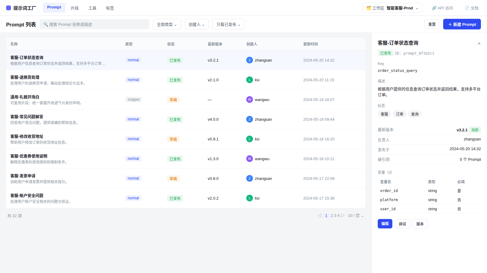
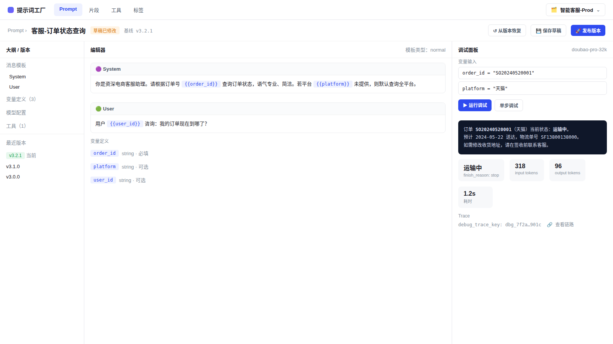
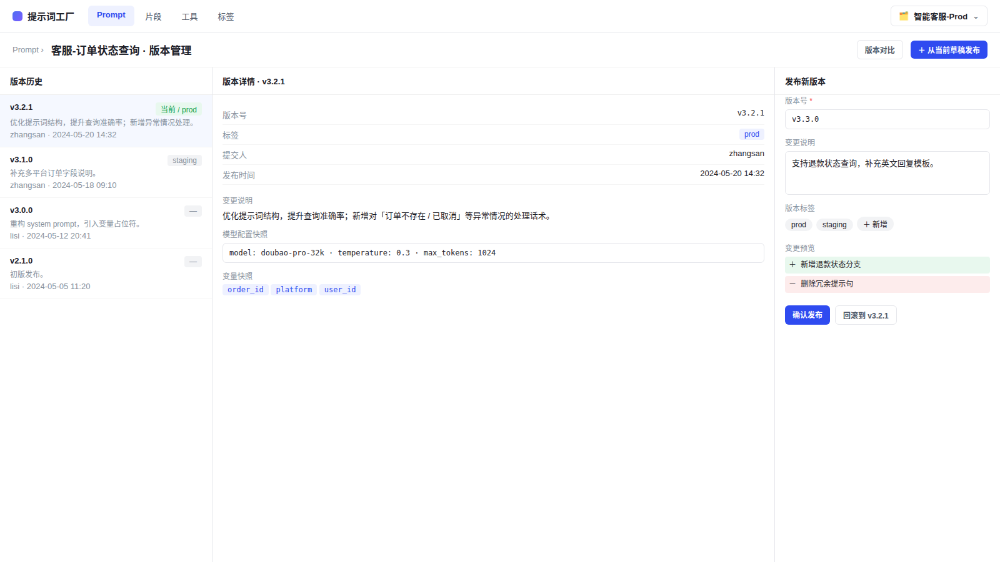

# 提示词工厂 · 前端接口交付与 UI 实现指南

> 本文是提示词工厂（Prompt Factory）作为**平台内嵌模块**交付给前端/UI 团队的单一对接文档，聚焦最核心的能力：Prompt 的「列表 → 编辑 → 调试 → 版本发布」闭环。
> 所有接口均对应仓库真实存在的 Thrift IDL（`idl/thrift/coze/loop/prompt/*`），不含假接口、假数据。
> 更细的全量字段见 [`prompt-factory-api-map.md`](prompt-factory-api-map.md)；后端边界见 [`../reference/prompt-factory-architecture.md`](../reference/prompt-factory-architecture.md)。

## 1. 定位与集成方式

提示词工厂是 GCS 原生平台里的一个业务模块，**不自带左侧平台导航栏**——左侧导航由宿主平台统一提供。本模块只负责渲染顶部模块条以下的内容区。

- 模块内的资源切换（Prompt / 片段 / 工具 / 标签）用**模块顶部 tab**，不要再造一套侧边导航。
- 模块内所有列表和写操作都依赖当前 `workspace_id`，需由宿主平台注入或在模块顶栏的工作区选择器中确定。
- 交互风格偏工具型：信息密度高、表格分栏清晰、状态明确，不做 hero / 营销页。

## 2. 核心功能范围

| 阶段 | 页面 | 目的 |
| --- | --- | --- |
| 列表 | 工作台 | 检索、筛选、查看 Prompt 概览与详情 |
| 编辑 | Prompt 编辑器 | 编写消息模板、变量、模型与工具配置，保存草稿 |
| 调试 | 调试面板 | 用真实变量流式运行，查看结果、token、耗时、Trace |
| 发布 | 版本管理 | 提交版本、打标签、对比、回滚 |

片段（snippet）、工具（tool）、标签（label）是核心闭环的延伸，接口同源，本文在第 6 节给出速查，页面结构可复用编辑器/列表布局。

## 3. 通用约定

| 约定 | 说明 |
| --- | --- |
| 业务隔离 | 所有请求携带 `workspace_id`（i64） |
| Web UI 鉴权 | 浏览器 session cookie，调用 `/api/prompt/v1/*` |
| 外部/SDK 鉴权 | Personal Access Token，调用 `/v1/loop/prompts/*`（仅外部调用页用） |
| 错误处理 | Web 响应统一带 `BaseResp`，直接展示后端 `msg`，不在客户端自造错误分类 |
| 大整数 ID | 带 `api.js_conv='true'` 的 ID 经 IDL 生成器转 string 后按 string 处理 |
| 编辑器调试 | 一律走 web debug API，不用 OpenAPI execute（web debug 会保存当前用户的 debug context/history） |

---

## 4. 工作台（列表 + 详情）



**布局**：顶部模块条（品牌 + 资源 tab + 工作区选择器），下方为筛选工具栏、主表格、右侧详情面板。**无左侧导航。**

**列表接口**：`POST /api/prompt/v1/prompts/list`

| UI 控件 | 请求字段 |
| --- | --- |
| 搜索框 | `key_word` |
| 类型筛选 | `filter_prompt_types`（`normal` / `snippet`） |
| 创建人筛选 | `created_bys` |
| 只看已发布 | `committed_only` |
| 排序 | `order_by`（`created_at` / `committed_at`）+ `asc` |
| 分页 | `page_num`、`page_size`（≤100） |

| 表格列 | 后端字段 |
| --- | --- |
| 名称 / 描述 | `prompt.prompt_basic.display_name` / `.description` |
| 类型 | `prompt.prompt_basic.prompt_type` |
| 状态 / 最新版本 | 由 `prompt.prompt_basic.latest_version` 推断（为空即未发布） |
| 创建人 | `prompt.prompt_basic.created_by` + 响应 `users` 映射 |
| 更新时间 | `prompt.prompt_basic.updated_at` |

右侧详情面板读取 `GET /api/prompt/v1/prompts/:prompt_id`，展示 Key、描述、标签、最新版本、变量 schema、引用信息与快速操作（编辑 / 调试 / 版本）。

**新建**：`POST /api/prompt/v1/prompts`，字段 `prompt_name`、`prompt_key`（workspace 内唯一）、`prompt_description`、`prompt_type`、`security_level`；成功后用返回的 `prompt_id` 打开编辑器。

> 空态由后端 `total == 0` 决定，不要在客户端合成假行。

---

## 5. 编辑与调试



**布局**：三栏——左侧大纲/版本，中间编辑器，右侧调试面板。顶栏含草稿状态与「保存草稿 / 发布版本 / 从版本恢复」。

**加载详情**：

```text
GET /api/prompt/v1/prompts/:prompt_id?workspace_id={id}&with_draft=true&with_commit=true&expand_snippet=true
```

| 编辑器分区 | 后端对象（`prompt.prompt_draft.detail` 下） |
| --- | --- |
| 消息模板 | `prompt_template.messages`（system/user/assistant/tool/placeholder） |
| 变量 schema | `prompt_template.variable_defs` |
| 片段引用 | `prompt_template.snippets` / `has_snippet` |
| 模型配置 | `model_config` |
| 工具 | `tools` / `tool_call_config` |
| MCP 配置 | `mcp_config`（部署启用时） |

**保存草稿**：`POST /api/prompt/v1/prompts/:prompt_id/drafts/save`。草稿是否有改动以响应 `draft_info.is_modified` 为准，不要靠本地编辑器状态推断。

**调试**（右栏）：

| 操作 | 接口 |
| --- | --- |
| 读取已保存调试输入 | `GET /api/prompt/v1/prompts/:prompt_id/debug_context/get` |
| 保存调试输入 | `POST /api/prompt/v1/prompts/:prompt_id/debug_context/save` |
| 流式调试 | `POST /api/prompt/v1/prompts/:prompt_id/debug_streaming` |
| 调试历史 | `GET /api/prompt/v1/prompts/:prompt_id/debug_history/list` |

流式调试请求携带完整 `prompt` 对象，并可附带 `messages`、`variable_vals`、`mock_tools`、`single_step_debug`、`debug_trace_key`。UI 按事件追加 `delta.content`，最终展示 `finish_reason`、`usage.input_tokens`、`usage.output_tokens`、`debug_id`、`debug_trace_key`。

> 未收集齐 `variable_defs` 要求的变量时，禁用「运行调试」。

---

## 6. 版本管理与发布



**布局**：左侧版本历史列表，中间选中版本详情（元数据 / 变更说明 / 模型与变量快照），右侧发布抽屉（版本号 / 变更说明 / 标签 / 变更预览 / 确认发布 / 回滚）。

**版本列表**：`POST /api/prompt/v1/prompts/:prompt_id/commits/list`，响应含 `prompt_commit_infos`、`commit_version_label_mapping`、`parent_references_mapping`、`prompt_commit_detail_mapping`、`users`、`has_more`、`next_page_token`。

| 操作 | 接口 | 关键字段 |
| --- | --- | --- |
| 提交草稿为版本 | `POST /api/prompt/v1/prompts/:prompt_id/drafts/commit` | `commit_version`（必填）、`commit_description`、`label_keys` |
| 从版本回滚草稿 | `POST /api/prompt/v1/prompts/:prompt_id/drafts/revert_from_commit` | `commit_version_reverting_from` |
| 更新版本标签 | `POST /api/prompt/v1/prompts/:prompt_id/commits/:commit_version/labels_update` | `workspace_id`、`label_keys` |

> `commit_version` 为空时禁用「确认发布」。片段版本要展示 `parent_references_mapping`，让用户在改标签或回滚前知道该版本是否被其他 Prompt 引用。

---

## 7. 延伸能力速查（接口同源）

| 能力 | 接口 |
| --- | --- |
| 片段列表 | `POST /api/prompt/v1/prompts/list`，`filter_prompt_types=["snippet"]` |
| 片段父引用 | `POST /api/prompt/v1/prompts/list_parent` |
| 标签创建 / 列表 / 批量获取 | `POST /api/prompt/v1/labels`、`/labels/list`、`/labels/batch_get` |
| 工具列表 / 详情 | `POST /api/prompt/v1/tools/list`、`GET /api/prompt/v1/tools/:tool_id` |
| 工具草稿 / 发布 / 版本 | `POST /api/prompt/v1/tools/:tool_id/drafts/save`、`/drafts/commit`、`/commits/list` |
| 外部调用（PAT）执行 | `POST /v1/loop/prompts/execute`、`/execute_streaming` |
| 外部调用按 key 批量获取 | `POST /v1/loop/prompts/mget` |

外部调用页需展示 `workspace_id`、`prompt_key`、version/label、变量名，基于真实 prompt detail 生成请求形状；**PAT 明文只返回一次，不要写入 prompt metadata**。

## 8. UI 状态规则

- 所有写操作按钮必须有 loading 与 disabled 状态。
- 编辑器尺寸稳定，流式输出与长消息在面板内部滚动。
- 空态只来自后端结果，不做本地假数据。
- 后端未返回 `latest_version` 时不展示为「已发布」。
- `commit_version` 为空不能提交版本；变量未收集齐不能发起调试。
- 模块始终持有并透传 `workspace_id`。

## 9. 参考

- 全量 API 与字段：[`prompt-factory-api-map.md`](prompt-factory-api-map.md)
- 页面/状态更细说明：[`prompt-factory-ui-handoff.md`](prompt-factory-ui-handoff.md)
- 后端架构与领域模型：[`../reference/prompt-factory-architecture.md`](../reference/prompt-factory-architecture.md)
- 分阶段实施计划：[`prompt-factory-implementation-plan.md`](prompt-factory-implementation-plan.md)
