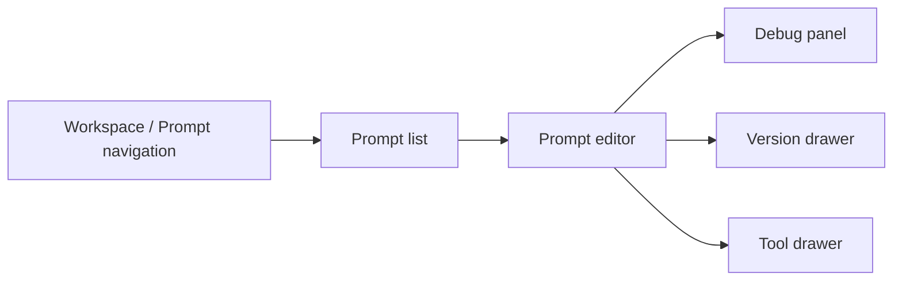

# 提示词工厂前端/UI 交接说明

> 本文是第一版 GCS Loop 提示词工厂给前端/UI 团队的统一交接说明，包含页面格局、状态规则和真实 API 对接表，只使用当前后端真实存在的接口。

## 功能页参考图

图片用于确定功能区域、分栏比例和交互入口；字段、接口、状态流转以本文后续章节为准。

### 1. 工作台总览

适用页面：Prompt 列表、搜索筛选、右侧 Prompt 详情。


实现要点：左侧固定导航，顶部保留 workspace、全局搜索、API 访问、文档、用户入口；主区以 Prompt 表格为核心；右侧详情面板展示选中 Prompt 的版本、变量、负责人和快速操作。

### 2. Prompt 编辑与调试

适用页面：Prompt 编辑器、变量定义、在线调试、调试历史。


实现要点：页面采用三栏结构：左侧摘要和版本，中心编辑器，右侧调试面板；编辑器支持 system/user 模板、变量定义、提交说明、草稿保存和版本发布；调试面板展示模型、变量输入、消息预览、运行结果、token/耗时/成本和 Trace。

### 3. 版本管理与发布

适用页面：版本历史、版本详情、版本对比、发布确认、回滚。


实现要点：左侧列表展示历史版本、状态、作者、提交说明和发布时间；中间展示选中版本元数据、变量定义、模型配置快照和发布说明；右侧抽屉展示版本 diff、变量变更、发布确认、回滚和复制为草稿入口。

### 4. 资源管理

适用页面：Snippet、Tool、Label 统一资源管理。


实现要点：顶部用 tab/segmented control 切换片段、工具、标签；主区以资源表格为核心，支持类型、状态、拥有者和关键词筛选；右侧编辑抽屉承载 Tool schema、鉴权、超时、测试输入和测试结果。

## 首屏

首屏应直接进入工厂工作台，不做营销型 landing page。



整体风格应偏工具型：信息密度高、表格和分栏清晰、工具栏稳定、状态明确。不要做大 hero、装饰卡片或介绍性页面。

## 全局布局

| 区域 | UI 要求 |
| --- | --- |
| 顶栏 | 空间选择、当前用户、PAT/API 入口、全局新建按钮 |
| 左侧导航 | Prompt、Snippet、Tool、Label、Debug history |
| 主列表 | 搜索、prompt type 筛选、创建人筛选、只看已发布开关、按 `created_at` 或 `committed_at` 排序 |
| 右侧工作区 | 编辑器或选中资源详情 |

UI 必须始终持有当前 `workspace_id`；prompt/tool 的列表和写操作都依赖它。

## 新建入口与页面

全局新建按钮应做成下拉菜单，不单独做空白新建页。入口至少包含：

| 入口 | 展示位置 | 创建接口 | 成功后 |
| --- | --- | --- | --- |
| 新建 Prompt | 顶栏、Prompt 列表页 | `POST /api/prompt/v1/prompts` | 打开 Prompt 编辑器，并用 `prompt_id` 拉详情 |
| 新建 Snippet | 顶栏、Snippet 页 | `POST /api/prompt/v1/prompts`，`prompt_type="snippet"` | 打开 Snippet 编辑器，并用 `prompt_id` 拉详情 |
| 新建 Tool | 顶栏、Tool 页 | `POST /api/prompt/v1/tools` | 打开 Tool 编辑抽屉，并用 `tool_id` 拉详情 |
| 新建 Label | Label 页、版本发布弹窗 | `POST /api/prompt/v1/labels` | 刷新 Label 列表或回填到当前表单 |
| 新建 API Token | PAT/API 访问页 | `POST /api/auth/v1/personal_access_tokens` | 展示一次性明文 token |

新建交互统一用 modal 或右侧 drawer，避免跳转到独立空页面。所有新建表单都必须有 loading、disabled 和后端错误展示；不要在前端预创建假资源。

### 新建 Prompt / Snippet

表单字段：

| UI 字段 | 请求字段 | 必填 | 说明 |
| --- | --- | --- | --- |
| 名称 | `prompt_name` | 是 | 展示名 |
| Key | `prompt_key` | 是 | 同一 `workspace_id` 下唯一 |
| 描述 | `prompt_description` | 否 | 列表和详情页展示 |
| 类型 | `prompt_type` | 是 | Prompt 用 `normal`，Snippet 用 `snippet` |
| 密级 | `security_level` | 否 | `L1` 到 `L4`；不填时以后端默认值为准 |
| 初始草稿 | `draft_detail` | 否 | 可为空，进入编辑器后再保存草稿 |

成功响应只返回 `prompt_id`。前端拿到 `prompt_id` 后立即进入编辑器，并调用：

```http
GET /api/prompt/v1/prompts/:prompt_id?workspace_id={workspace_id}&with_draft=true&with_commit=true&with_default_config=true&expand_snippet=true
```

如果后端返回 Key 重复或校验错误，直接展示 `BaseResp` 信息，不在前端自造重复校验结果。

### 新建 Tool

表单字段：

| UI 字段 | 请求字段 | 必填 | 说明 |
| --- | --- | --- | --- |
| 名称 | `tool_name` | 是 | 工具展示名 |
| 描述 | `tool_description` | 否 | 列表和详情页展示 |
| 初始详情 | `draft_detail` | 否 | 结构为 `ToolDetail`；可先创建空工具，再进入抽屉编辑 |

成功响应返回 `tool_id`。前端拿到 `tool_id` 后进入工具编辑抽屉，并调用：

```http
GET /api/prompt/v1/tools/:tool_id?workspace_id={workspace_id}
```

Tool 的具体 schema、鉴权、endpoint、测试参数如果后端当前只承载在 `draft_detail.content` 或 `draft_detail.ext_infos`，前端必须按结构化 JSON 保存，不要拆到本地假字段。

### 新建 Label

Label 当前后端只定义了 `label.key`，没有颜色、描述、排序字段。

| UI 字段 | 请求字段 | 必填 | 说明 |
| --- | --- | --- | --- |
| Label Key | `label.key` | 是 | 版本标签稳定标识 |

如果 UI 要展示颜色 swatch，只能作为前端展示策略或后续 schema 扩展，第一阶段不能假装后端已经持久化颜色。

### 新建 API Token

PAT/API 访问页用于外部调用提示词工厂 OpenAPI。

| UI 字段 | 请求字段 | 必填 | 说明 |
| --- | --- | --- | --- |
| 名称 | `name` | 是 | Token 名称 |
| 有效期枚举 | `duration_day` | 否 | `1`、`30`、`60`、`90`、`180`、`365`、`permanent` |
| 自定义过期时间 | `expire_at` | 否 | Unix 秒；和 `duration_day` 二选一 |

创建成功响应包含 `personal_access_token` 和明文 `token`。明文 `token` 只展示一次，页面需要提供复制按钮和关闭确认。

## Prompt 列表

使用 `POST /api/prompt/v1/prompts/list`。

必要列：

| 列 | 后端字段 |
| --- | --- |
| 名称 | `prompt.prompt_basic.display_name` |
| Key | `prompt.prompt_key` |
| 类型 | `prompt.prompt_basic.prompt_type` |
| 最新版本 | `prompt.prompt_basic.latest_version` |
| 密级 | `prompt.prompt_basic.security_level` |
| 创建人 | `prompt.prompt_basic.created_by`，结合响应里的 `users` 映射 |
| 更新时间 | `prompt.prompt_basic.updated_at` |
| 最近发布时间 | `prompt.prompt_basic.latest_committed_at` |

列表控件：

| 控件 | 请求字段 |
| --- | --- |
| 搜索框 | `key_word` |
| 创建人多选 | `created_bys` |
| 只看已发布 | `committed_only` |
| 类型分段控件 | `filter_prompt_types`，值为 `normal` 或 `snippet` |
| 排序菜单 | `order_by=created_at` 或 `committed_at`，配合 `asc` |

不要在客户端合成假行。空态应由后端返回的 `total == 0` 决定。

## Prompt 编辑器

加载详情：

```text
GET /api/prompt/v1/prompts/:prompt_id?workspace_id={workspace_id}&with_draft=true&with_commit=true&expand_snippet=true
```

编辑器分区：

| 分区 | 后端对象 |
| --- | --- |
| 消息模板 | `prompt.prompt_draft.detail.prompt_template.messages` |
| 变量 schema | `prompt.prompt_draft.detail.prompt_template.variable_defs` |
| Snippet 引用 | `prompt.prompt_draft.detail.prompt_template.snippets` 和 `has_snippet` |
| 模型配置 | `prompt.prompt_draft.detail.model_config` |
| 工具 | `prompt.prompt_draft.detail.tools` 和 `tool_call_config` |
| MCP 配置 | 启用时读取 `prompt.prompt_draft.detail.mcp_config` |

保存草稿使用 `POST /api/prompt/v1/prompts/:prompt_id/drafts/save`。

草稿是否有改动以 `draft_info.is_modified` 为准，不要靠本地编辑器状态推断发布状态。

## 版本抽屉

使用 `POST /api/prompt/v1/prompts/:prompt_id/commits/list`。

版本操作：

| 操作 | API |
| --- | --- |
| 提交草稿 | `POST /api/prompt/v1/prompts/:prompt_id/drafts/commit` |
| 从版本回滚草稿 | `POST /api/prompt/v1/prompts/:prompt_id/drafts/revert_from_commit` |
| 更新版本标签 | `POST /api/prompt/v1/prompts/:prompt_id/commits/:commit_version/labels_update` |

提交表单：

| 字段 | 请求字段 |
| --- | --- |
| 版本号 | `commit_version` |
| 描述 | `commit_description` |
| 标签 | `label_keys` |

Snippet 版本要展示 `parent_references_mapping`，让用户在改标签或回滚前知道该版本是否被其他 prompt 引用。

## Snippet 工厂

Snippet 是 `prompt_type=snippet` 的 prompt。

| 功能 | API |
| --- | --- |
| 列出 snippet | `POST /api/prompt/v1/prompts/list`，`filter_prompt_types=["snippet"]` |
| 新建 snippet | `POST /api/prompt/v1/prompts`，`prompt_type="snippet"` |
| 查看父 prompt 引用 | `POST /api/prompt/v1/prompts/list_parent` |

普通 prompt 插入 snippet 时，应选择 snippet prompt 和已发布版本。后端在 `expand_snippet=true` 时展开片段。

## Tool 管理

工具页使用真实 tool API：

| 页面/操作 | API |
| --- | --- |
| Tool 列表 | `POST /api/prompt/v1/tools/list` |
| 新建 Tool | `POST /api/prompt/v1/tools` |
| Tool 详情 | `GET /api/prompt/v1/tools/:tool_id` |
| 保存 Tool 草稿 | `POST /api/prompt/v1/tools/:tool_id/drafts/save` |
| 提交 Tool 版本 | `POST /api/prompt/v1/tools/:tool_id/drafts/commit` |
| Tool 版本列表 | `POST /api/prompt/v1/tools/:tool_id/commits/list` |

Prompt 编辑器可以直接绑定内联 `prompt.Tool`。如果 UI 提供可复用 Tool 资产，则必须展示版本状态。

## Debug 面板

编辑器调试使用 web debug API，不走 OpenAPI execute。

| 操作 | API |
| --- | --- |
| 加载已保存调试输入 | `GET /api/prompt/v1/prompts/:prompt_id/debug_context/get` |
| 保存调试输入 | `POST /api/prompt/v1/prompts/:prompt_id/debug_context/save` |
| 流式调试 | `POST /api/prompt/v1/prompts/:prompt_id/debug_streaming` |
| 调试历史 | `GET /api/prompt/v1/prompts/:prompt_id/debug_history/list` |

Debug 请求需要完整 `prompt` 对象，并可附带 `messages`、`variable_vals`、`mock_tools`、`single_step_debug` 和 `debug_trace_key`。

流式返回时，UI 按事件追加 `delta.content`，并展示最终的 `finish_reason`、`usage.input_tokens`、`usage.output_tokens`、`debug_id`、`debug_trace_key`。

## 外部调用页

外部服务使用 OpenAPI 和 PAT：

| 场景 | API |
| --- | --- |
| API 新建 prompt | `POST /v1/loop/prompts` |
| 列出 prompt basic | `POST /v1/loop/prompts/list` |
| 按 key/version/label 获取 | `POST /v1/loop/prompts/mget` |
| 执行 | `POST /v1/loop/prompts/execute` |
| 流式执行 | `POST /v1/loop/prompts/execute_streaming` |

页面应展示当前 `workspace_id`、`prompt_key`、version/label、变量名，并基于真实 prompt detail 生成请求形状。不要把 PAT token 存进 prompt metadata。

## UI 状态规则

- 所有写操作按钮必须有 loading 和 disabled 状态。
- 编辑器尺寸要稳定；流式输出和长消息在面板内部滚动。
- 空态只来自后端结果，不做本地假数据。
- 后端未返回 `latest_version` 时，不要展示为已发布。
- `commit_version` 为空时不能提交版本。
- 未收集 `variable_defs` 所需变量时不能发起 debug。

## API 对接表

> 本文是前端联调用的真实 API 映射。契约源头是 `idl/thrift/coze/loop/prompt` 下的 Thrift IDL。

### 基础概念

| 概念 | 后端字段 |
| --- | --- |
| 工作空间 | `workspace_id` |
| Prompt 主键 | `prompt_id` 或 `prompt.id` |
| Prompt 稳定标识 | `prompt_key` |
| 草稿 | `prompt_draft` |
| 发布版本 | `commit_version` 或 `prompt_commit.commit_info.version` |
| 标签 | `label.key` |
| Prompt 类型 | `normal`、`snippet` |

所有带 `api.js_conv='true'` 的 ID，前端如果通过 IDL 生成器转成 string，就按 string 处理。

### UI 必需 Foundation API

| 功能 | Method 和路径 | 说明 |
| --- | --- | --- |
| 注册 | `POST /api/foundation/v1/users/register` | 写入 session cookie |
| 登录 | `POST /api/foundation/v1/users/login_by_password` | 写入 session cookie |
| 当前会话 | `GET /api/foundation/v1/users/session` | 读取 cookie |
| 用户空间 | `POST /api/foundation/v1/spaces/list` | 选择 `workspace_id` |
| PAT 列表 | `POST /api/auth/v1/personal_access_tokens/list` | OpenAPI 凭据页 |
| 创建 PAT | `POST /api/auth/v1/personal_access_tokens` | 明文 token 仅返回一次 |

#### 创建 PAT

```http
POST /api/auth/v1/personal_access_tokens
```

请求字段：

| 字段 | 类型 | 必填 | 说明 |
| --- | --- | --- | --- |
| `name` | string | 是 | PAT 名称 |
| `duration_day` | string | 否 | `1`、`30`、`60`、`90`、`180`、`365`、`permanent` |
| `expire_at` | i64 | 否 | 自定义过期时间，Unix 秒 |

响应字段：`personal_access_token`、`token`、`BaseResp`。`token` 是明文，只展示一次。

### Prompt 管理链路

#### 列表

```http
POST /api/prompt/v1/prompts/list
```

请求字段：

| 字段 | 类型 | 必填 |
| --- | --- | --- |
| `workspace_id` | i64 | 是 |
| `key_word` | string | 否 |
| `created_bys` | list<string> | 否 |
| `committed_only` | bool | 否 |
| `filter_prompt_types` | list<PromptType> | 否 |
| `page_num` | i32 | 是 |
| `page_size` | i32，最大 100 | 是 |
| `order_by` | `created_at` 或 `committed_at` | 否 |
| `asc` | bool | 否 |

响应字段：`prompts`、`users`、`total`、`BaseResp`。

#### 新建

```http
POST /api/prompt/v1/prompts
```

请求字段：

| 字段 | 类型 | 必填 | 说明 |
| --- | --- | --- | --- |
| `workspace_id` | i64 | 是 | 当前工作空间 |
| `prompt_name` | string | 是 | 展示名 |
| `prompt_key` | string | 是 | 稳定唯一 key |
| `prompt_description` | string | 否 | 描述 |
| `prompt_type` | PromptType | 否 | `normal` 或 `snippet` |
| `security_level` | SecurityLevel | 否 | `L1` 到 `L4` |
| `draft_detail` | PromptDetail | 否 | 初始草稿详情 |

响应字段：`prompt_id`、`BaseResp`。

#### 详情

```http
GET /api/prompt/v1/prompts/:prompt_id
```

Query 字段：

| 字段 | 含义 |
| --- | --- |
| `workspace_id` | 工作空间保护 |
| `with_commit` | 返回已发布详情 |
| `commit_version` | 指定版本；支持处为空时取最新版本 |
| `with_draft` | 返回当前用户草稿 |
| `with_default_config` | 返回默认 prompt 配置 |
| `expand_snippet` | 展开 snippet 引用 |

响应字段：`prompt`、`default_config`、`total_parent_references`、`BaseResp`。

#### 更新基础信息

```http
PUT /api/prompt/v1/prompts/:prompt_id
```

请求字段：`prompt_name`、`prompt_description`、`security_level`、`downgrade_reason`。

#### 保存草稿

```http
POST /api/prompt/v1/prompts/:prompt_id/drafts/save
```

核心请求字段：

| 字段 | 类型 |
| --- | --- |
| `prompt_draft.detail.prompt_template` | 消息、变量、metadata |
| `prompt_draft.detail.tools` | 绑定工具 |
| `prompt_draft.detail.tool_call_config` | 工具选择 |
| `prompt_draft.detail.model_config` | 模型配置 |
| `prompt_draft.detail.mcp_config` | MCP 配置 |

响应字段：`draft_info`、`BaseResp`。

#### 提交版本

```http
POST /api/prompt/v1/prompts/:prompt_id/drafts/commit
```

请求字段：`commit_version`、`commit_description`、`label_keys`。

#### 版本列表

```http
POST /api/prompt/v1/prompts/:prompt_id/commits/list
```

请求字段：`with_commit_detail`、`page_size`、`page_token`、`asc`。

响应字段：`prompt_commit_infos`、`commit_version_label_mapping`、`parent_references_mapping`、`prompt_commit_detail_mapping`、`users`、`has_more`、`next_page_token`。

#### 版本维护

| 操作 | Method 和路径 | 关键字段 |
| --- | --- | --- |
| 从版本回滚草稿 | `POST /api/prompt/v1/prompts/:prompt_id/drafts/revert_from_commit` | `commit_version_reverting_from` |
| 更新标签 | `POST /api/prompt/v1/prompts/:prompt_id/commits/:commit_version/labels_update` | `workspace_id`、`label_keys` |
| 删除 prompt | `DELETE /api/prompt/v1/prompts/:prompt_id` | path `prompt_id` |

### Label API

| 功能 | Method 和路径 | 关键字段 |
| --- | --- | --- |
| 创建 label | `POST /api/prompt/v1/labels` | `workspace_id`、`label.key` |
| 列出 label | `POST /api/prompt/v1/labels/list` | `workspace_id`、`label_key_like`、`with_prompt_version_mapping`、`prompt_id`、`page_size`、`page_token` |
| 批量获取 label | `POST /api/prompt/v1/labels/batch_get` | `workspace_id`、`label_keys` |

#### 创建 Label

```http
POST /api/prompt/v1/labels
```

请求字段：

| 字段 | 类型 | 必填 | 说明 |
| --- | --- | --- | --- |
| `workspace_id` | i64 | 是 | 当前工作空间 |
| `label.key` | string | 是 | 标签 key |

响应字段：`BaseResp`。当前接口不返回颜色、描述或排序信息。

### Snippet API

Snippet 复用 Prompt API，区别是 `prompt_type="snippet"`。

```http
POST /api/prompt/v1/prompts/list_parent
```

请求字段：`workspace_id`、`prompt_id`、`commit_versions`。

响应字段：`parent_prompts`，key 为 snippet version。

### Debug API

#### 流式 Debug

```http
POST /api/prompt/v1/prompts/:prompt_id/debug_streaming
```

请求字段：

| 字段 | 含义 |
| --- | --- |
| `prompt` | 待调试的完整 prompt 对象 |
| `messages` | 运行时消息 |
| `variable_vals` | `variable_defs` 对应的变量值 |
| `mock_tools` | 工具 mock 输出 |
| `single_step_debug` | 必填 bool |
| `debug_trace_key` | 继续或关联调试 trace |

流式响应字段：`delta`、`finish_reason`、`usage`、`debug_id`、`debug_trace_key`、`BaseResp`。

#### Debug Context

| 功能 | Method 和路径 |
| --- | --- |
| 保存 | `POST /api/prompt/v1/prompts/:prompt_id/debug_context/save` |
| 获取 | `GET /api/prompt/v1/prompts/:prompt_id/debug_context/get` |
| 历史 | `GET /api/prompt/v1/prompts/:prompt_id/debug_history/list` |

历史查询字段：`workspace_id`、`days_limit`、`page_size`、`page_token`。

### Tool API

| 功能 | Method 和路径 |
| --- | --- |
| 创建 | `POST /api/prompt/v1/tools` |
| 详情 | `GET /api/prompt/v1/tools/:tool_id` |
| 列表 | `POST /api/prompt/v1/tools/list` |
| 保存草稿 | `POST /api/prompt/v1/tools/:tool_id/drafts/save` |
| 提交版本 | `POST /api/prompt/v1/tools/:tool_id/drafts/commit` |
| 版本列表 | `POST /api/prompt/v1/tools/:tool_id/commits/list` |
| 批量获取 | `POST /api/prompt/v1/tools/mget` |

#### 创建 Tool

```http
POST /api/prompt/v1/tools
```

请求字段：

| 字段 | 类型 | 必填 | 说明 |
| --- | --- | --- | --- |
| `workspace_id` | i64 | 是 | 当前工作空间 |
| `tool_name` | string | 是 | 工具名 |
| `tool_description` | string | 否 | 工具描述 |
| `draft_detail` | ToolDetail | 否 | 初始工具详情，包含 `content` 和 `ext_infos` |

响应字段：`tool_id`、`BaseResp`。

### OpenAPI 运行时 API

这些接口用于服务间调用或 SDK 调用。

| 功能 | Method 和路径 |
| --- | --- |
| 按 key 批量获取 | `POST /v1/loop/prompts/mget` |
| 执行 | `POST /v1/loop/prompts/execute` |
| 流式执行 | `POST /v1/loop/prompts/execute_streaming` |
| 列出基础信息 | `POST /v1/loop/prompts/list` |
| 新建 prompt | `POST /v1/loop/prompts` |
| 删除 prompt | `DELETE /v1/loop/prompts/:prompt_id` |
| 获取 prompt | `GET /v1/loop/prompts/:prompt_id` |
| 保存草稿 | `POST /v1/loop/prompts/:prompt_id/drafts/save` |
| 版本列表 | `POST /v1/loop/prompts/:prompt_id/commits/list` |
| 提交版本 | `POST /v1/loop/prompts/:prompt_id/drafts/commit` |

OpenAPI 新建 prompt 请求字段：`workspace_id`、`prompt_name`、`prompt_key`、`prompt_description`、`prompt_type`、`security_level`。响应字段：`code`、`msg`、`prompt_id`、`BaseResp`。

执行请求核心字段：

| 字段 | 含义 |
| --- | --- |
| `workspace_id` | 工作空间 |
| `prompt_identifier.prompt_key` | Prompt key |
| `prompt_identifier.version` | 指定版本 |
| `prompt_identifier.label` | 版本标签；传了 `version` 时会被忽略 |
| `variable_vals` | 运行时变量 |
| `messages` | 额外运行时消息 |
| `custom_tools` | 单次调用工具覆盖 |
| `custom_tool_call_config` | 单次调用工具策略覆盖 |
| `custom_model_config` | 单次调用模型配置覆盖 |
| `response_api_config` | Response API session/cache 字段 |
| `usage_scenario` | `default`、`evaluation`、`prompt_as_a_service`、`ai_annotate`、`ai_score`、`ai_tag` |

### 错误处理

Web API 都有 `BaseResp`；OpenAPI 响应还会暴露 `code` 和 `msg`。前端应直接展示后端错误信息，不要在客户端自造错误分类。
