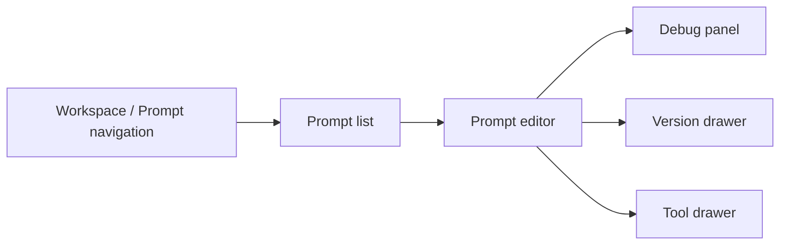

# 提示词工厂 UI 交接说明

> 本文是第一版 GCS Loop 提示词工厂给 UI/前端团队的页面与状态说明，只使用当前后端真实存在的接口。
> 功能页参考图见 [`prompt-factory-ui-mockups.md`](prompt-factory-ui-mockups.md)。

## 首屏

首屏应直接进入工厂工作台，不做营销型 landing page。



整体风格应偏工具型：信息密度高、表格和分栏清晰、工具栏稳定、状态明确。不要做大 hero、装饰卡片或介绍性页面。

## 全局布局

| 区域 | UI 要求 |
| --- | --- |
| 顶栏 | 空间选择、当前用户、PAT/API 入口、全局新建按钮 |
| 左侧导航 | Prompt、Snippet、Tool、Label、Debug history |
| 主列表 | 搜索、prompt type 筛选、创建人筛选、只看已发布开关、按 `created_at` 或 `committed_at` 排序 |
| 右侧工作区 | 编辑器或选中资源详情 |

UI 必须始终持有当前 `workspace_id`；prompt/tool 的列表和写操作都依赖它。

## Prompt 列表

使用 `POST /api/prompt/v1/prompts/list`。

必要列：

| 列 | 后端字段 |
| --- | --- |
| 名称 | `prompt.prompt_basic.display_name` |
| Key | `prompt.prompt_key` |
| 类型 | `prompt.prompt_basic.prompt_type` |
| 最新版本 | `prompt.prompt_basic.latest_version` |
| 密级 | `prompt.prompt_basic.security_level` |
| 创建人 | `prompt.prompt_basic.created_by`，结合响应里的 `users` 映射 |
| 更新时间 | `prompt.prompt_basic.updated_at` |
| 最近发布时间 | `prompt.prompt_basic.latest_committed_at` |

列表控件：

| 控件 | 请求字段 |
| --- | --- |
| 搜索框 | `key_word` |
| 创建人多选 | `created_bys` |
| 只看已发布 | `committed_only` |
| 类型分段控件 | `filter_prompt_types`，值为 `normal` 或 `snippet` |
| 排序菜单 | `order_by=created_at` 或 `committed_at`，配合 `asc` |

不要在客户端合成假行。空态应由后端返回的 `total == 0` 决定。

## 新建 Prompt

使用 `POST /api/prompt/v1/prompts`。

字段：

| UI 字段 | 请求字段 | 说明 |
| --- | --- | --- |
| 名称 | `prompt_name` | 必填 |
| Key | `prompt_key` | 必填，同一 workspace 下唯一 |
| 描述 | `prompt_description` | 可选 |
| 类型 | `prompt_type` | `normal` 或 `snippet` |
| 密级 | `security_level` | `L1` 到 `L4` |
| 初始草稿 | `draft_detail` | 可选；也可以创建后再保存草稿 |

创建成功后，用响应里的 `prompt_id` 打开编辑器。

## Prompt 编辑器

加载详情：

```text
GET /api/prompt/v1/prompts/:prompt_id?workspace_id={workspace_id}&with_draft=true&with_commit=true&expand_snippet=true
```

编辑器分区：

| 分区 | 后端对象 |
| --- | --- |
| 消息模板 | `prompt.prompt_draft.detail.prompt_template.messages` |
| 变量 schema | `prompt.prompt_draft.detail.prompt_template.variable_defs` |
| Snippet 引用 | `prompt.prompt_draft.detail.prompt_template.snippets` 和 `has_snippet` |
| 模型配置 | `prompt.prompt_draft.detail.model_config` |
| 工具 | `prompt.prompt_draft.detail.tools` 和 `tool_call_config` |
| MCP 配置 | 启用时读取 `prompt.prompt_draft.detail.mcp_config` |

保存草稿使用 `POST /api/prompt/v1/prompts/:prompt_id/drafts/save`。

草稿是否有改动以 `draft_info.is_modified` 为准，不要靠本地编辑器状态推断发布状态。

## 版本抽屉

使用 `POST /api/prompt/v1/prompts/:prompt_id/commits/list`。

版本操作：

| 操作 | API |
| --- | --- |
| 提交草稿 | `POST /api/prompt/v1/prompts/:prompt_id/drafts/commit` |
| 从版本回滚草稿 | `POST /api/prompt/v1/prompts/:prompt_id/drafts/revert_from_commit` |
| 更新版本标签 | `POST /api/prompt/v1/prompts/:prompt_id/commits/:commit_version/labels_update` |

提交表单：

| 字段 | 请求字段 |
| --- | --- |
| 版本号 | `commit_version` |
| 描述 | `commit_description` |
| 标签 | `label_keys` |

Snippet 版本要展示 `parent_references_mapping`，让用户在改标签或回滚前知道该版本是否被其他 prompt 引用。

## Snippet 工厂

Snippet 是 `prompt_type=snippet` 的 prompt。

| 功能 | API |
| --- | --- |
| 列出 snippet | `POST /api/prompt/v1/prompts/list`，`filter_prompt_types=["snippet"]` |
| 新建 snippet | `POST /api/prompt/v1/prompts`，`prompt_type="snippet"` |
| 查看父 prompt 引用 | `POST /api/prompt/v1/prompts/list_parent` |

普通 prompt 插入 snippet 时，应选择 snippet prompt 和已发布版本。后端在 `expand_snippet=true` 时展开片段。

## Tool 管理

工具页使用真实 tool API：

| 页面/操作 | API |
| --- | --- |
| Tool 列表 | `POST /api/prompt/v1/tools/list` |
| 新建 Tool | `POST /api/prompt/v1/tools` |
| Tool 详情 | `GET /api/prompt/v1/tools/:tool_id` |
| 保存 Tool 草稿 | `POST /api/prompt/v1/tools/:tool_id/drafts/save` |
| 提交 Tool 版本 | `POST /api/prompt/v1/tools/:tool_id/drafts/commit` |
| Tool 版本列表 | `POST /api/prompt/v1/tools/:tool_id/commits/list` |

Prompt 编辑器可以直接绑定内联 `prompt.Tool`。如果 UI 提供可复用 Tool 资产，则必须展示版本状态。

## Debug 面板

编辑器调试使用 web debug API，不走 OpenAPI execute。

| 操作 | API |
| --- | --- |
| 加载已保存调试输入 | `GET /api/prompt/v1/prompts/:prompt_id/debug_context/get` |
| 保存调试输入 | `POST /api/prompt/v1/prompts/:prompt_id/debug_context/save` |
| 流式调试 | `POST /api/prompt/v1/prompts/:prompt_id/debug_streaming` |
| 调试历史 | `GET /api/prompt/v1/prompts/:prompt_id/debug_history/list` |

Debug 请求需要完整 `prompt` 对象，并可附带 `messages`、`variable_vals`、`mock_tools`、`single_step_debug` 和 `debug_trace_key`。

流式返回时，UI 按事件追加 `delta.content`，并展示最终的 `finish_reason`、`usage.input_tokens`、`usage.output_tokens`、`debug_id`、`debug_trace_key`。

## 外部调用页

外部服务使用 OpenAPI 和 PAT：

| 场景 | API |
| --- | --- |
| API 新建 prompt | `POST /v1/loop/prompts` |
| 列出 prompt basic | `POST /v1/loop/prompts/list` |
| 按 key/version/label 获取 | `POST /v1/loop/prompts/mget` |
| 执行 | `POST /v1/loop/prompts/execute` |
| 流式执行 | `POST /v1/loop/prompts/execute_streaming` |

页面应展示当前 `workspace_id`、`prompt_key`、version/label、变量名，并基于真实 prompt detail 生成请求形状。不要把 PAT token 存进 prompt metadata。

## UI 状态规则

- 所有写操作按钮必须有 loading 和 disabled 状态。
- 编辑器尺寸要稳定；流式输出和长消息在面板内部滚动。
- 空态只来自后端结果，不做本地假数据。
- 后端未返回 `latest_version` 时，不要展示为已发布。
- `commit_version` 为空时不能提交版本。
- 未收集 `variable_defs` 所需变量时不能发起 debug。
