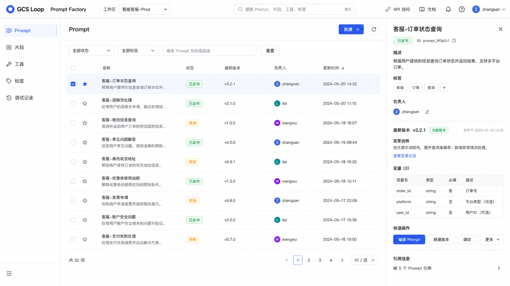
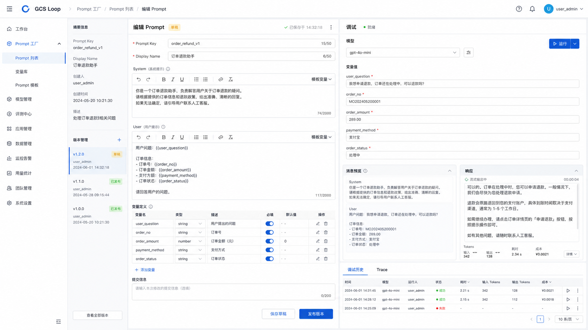
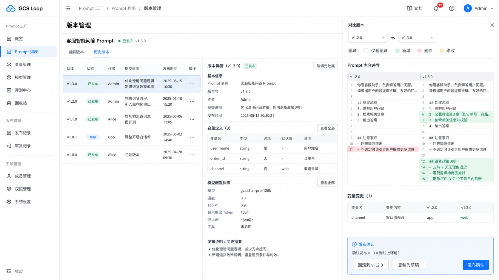
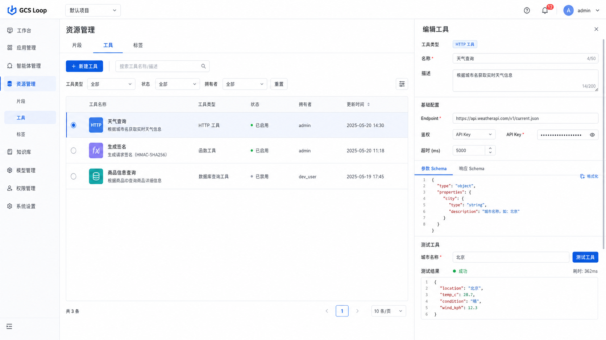

# 提示词工厂功能页参考图

> 本文档给 UI/前端团队提供页面格局参考。图片用于确定功能区域、分栏比例和交互入口；字段、接口、状态流转以 [`prompt-factory-ui-handoff.md`](prompt-factory-ui-handoff.md) 和 [`prompt-factory-api-map.md`](prompt-factory-api-map.md) 为准。

## 1. 工作台总览

适用页面：Prompt 列表、搜索筛选、右侧 Prompt 详情。

实现要点：

- 左侧固定导航，顶部保留 workspace、全局搜索、API 访问、文档、用户入口。
- 主区以 Prompt 表格为核心，支持状态、标签、关键词筛选。
- 右侧详情面板展示选中 Prompt 的版本、变量、负责人和快速操作。

## 2. Prompt 编辑与调试

适用页面：Prompt 编辑器、变量定义、在线调试、调试历史。

实现要点：

- 页面采用三栏结构：左侧摘要和版本，中心编辑器，右侧调试面板。
- 编辑器同时支持 system/user 模板、变量定义、提交说明、草稿保存和版本发布。
- 调试面板展示模型、变量输入、消息预览、运行结果、token/耗时/成本和 Trace。

## 3. 版本管理与发布

适用页面：版本历史、版本详情、版本对比、发布确认、回滚。

实现要点：

- 左侧列表展示历史版本、状态、作者、提交说明和发布时间。
- 中间区域展示选中版本的元数据、变量定义、模型配置快照和发布说明。
- 右侧抽屉展示版本 diff、变量变更、发布确认、回滚和复制为草稿入口。

## 4. 资源管理

适用页面：Snippet、Tool、Label 统一资源管理。

实现要点：

- 顶部用 tab/segmented control 切换片段、工具、标签。
- 主区以资源表格为核心，支持类型、状态、拥有者和关键词筛选。
- 右侧编辑抽屉承载 Tool schema、鉴权、超时、测试输入和测试结果。
