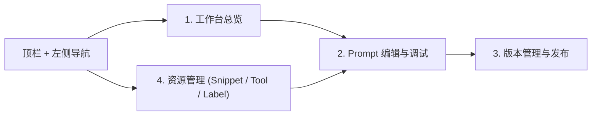

# 提示词工厂功能页参考图

> 本文档给 UI/前端团队提供页面格局参考。图用于确定**功能区域、分栏比例和交互入口**，不是高保真视觉稿；字段、接口、状态流转以 [`prompt-factory-ui-handoff.md`](prompt-factory-ui-handoff.md) 和 [`prompt-factory-api-map.md`](prompt-factory-api-map.md) 为准。
>
> 参考图采用低保真线框（ASCII wireframe）而非像素级截图：只约束布局与交互，视觉细节交给设计系统。每个功能区都标了对应的后端接口，确保功能覆盖完整、不遗漏。

## 页面导航关系



## 全局框架

所有页面共用同一套外框：顶栏 + 左侧导航。主区与右侧面板随页面切换。

```text
┌──────────────────────────────────────────────────────────────────────────────────────────┐
│ [GCS Loop · Prompt 工厂]  [工作区 ▼]      [🔍 全局搜索 Prompt/片段/工具/标签  ⌘K]   API访问 文档 🔔 ?  [用户 ▼] │  顶栏
├────────────┬─────────────────────────────────────────────────────────────────────────────┤
│ 左侧导航    │                                                                             │
│ ▸ Prompt    │                          主区（列表 / 编辑器 / 版本 / 资源）                    │
│ ▸ 片段      │                                                                             │
│ ▸ 工具      │                                                                             │
│ ▸ 标签      │                                                                             │
│ ▸ 调试记录  │                                                                             │
└────────────┴─────────────────────────────────────────────────────────────────────────────┘
```

| 区域 | 内容 | 接口/字段 |
| --- | --- | --- |
| 工作区选择 | 切换 `workspace_id`，列表与写操作都依赖它 | `POST /api/foundation/v1/spaces/list` |
| 全局搜索 | 跨 Prompt / 片段 / 工具 / 标签 | 复用各资源 `list` 接口的 `key_word` |
| API 访问 | PAT 凭据入口（OpenAPI 调用页） | `POST /api/auth/v1/personal_access_tokens[/list]` |
| 用户 | 当前会话与登出 | `GET /api/foundation/v1/users/session` |
| 左侧导航 | Prompt、片段(snippet)、工具(tool)、标签(label)、调试记录 | — |

---

## 1. 工作台总览

适用页面：Prompt 列表、搜索筛选、右侧 Prompt 详情。

```text
┌ 主区：Prompt 列表 ─────────────────────────────────────────┐┌ 右侧：Prompt 详情 ───────────────┐
│ Prompt                        [新建 ▾] [刷新]              ││ 客服-订单状态查询            [×] │
│                                                            ││ [已发布]  ID: prompt_8f3a…  [复制]│
│ [全部状态▾][全部类型▾][创建人▾]  [🔍 名称/描述]  [☐只看已发布]││                                  │
│                                                   [排序 ▾] ││ 描述：根据用户信息查询订单状态…    │
│ ┌───────────────────────────────────────────────────────┐ ││ 标签： [客服][订单][查询] [＋]    │
│ │☐ 名称           类型   最新版本 密级 创建人  更新时间↓ │ ││ 创建人：zhangsan                 │
│ ├───────────────────────────────────────────────────────┤ ││                                  │
│ │☑ 客服-订单状态  normal  v3.2.1  L2  zhangsan 05-20 14:32│ ││ 最新版本 v3.2.1  [当前]          │
│ │☐ 客服-退换货    normal  v2.1.0  L2  lisi     05-20 11:15│ ││ 发布于 05-20 14:32               │
│ │☐ 物流查询片段   snippet v1.0.0  L1  wangwu   05-19 18:07│ ││ 变更说明：优化措辞…  [查看变更]    │
│ │☐ 常见问题解答   normal  v4.0.0  L3  zhangsan 05-19 09:44│ ││                                  │
│ │… （空态由后端 total==0 决定，不本地造行）              │ ││ 变量 (3)                         │
│ └───────────────────────────────────────────────────────┘ ││  变量名    类型   必填 描述       │
│                                                            ││  order_id  string  是  订单号     │
│ 共 32 项            [< 1 2 3 4 >]         [10 / 页 ▾]      ││  platform  string  否  平台(可选) │
│                                                            ││  user_id   string  否  用户(可选) │
│                                                            ││                                  │
│                                                            ││ 快速操作：                       │
│                                                            ││ [编辑][新建版本][调试][更多▾]    │
│                                                            ││ 引用信息：被 5 个 Prompt 引用 >  │
└────────────────────────────────────────────────────────────┘└──────────────────────────────────┘
```

功能区域与接口：

| 区域 | 说明 | 接口/字段 |
| --- | --- | --- |
| 列表 | 名称/类型/最新版本/密级/创建人/更新时间 列 | `POST /api/prompt/v1/prompts/list`；行来自 `prompts`，创建人经 `users` 映射 |
| 筛选栏 | 状态、类型分段、创建人多选、关键词、只看已发布 | `filter_prompt_types`、`created_bys`、`key_word`、`committed_only` |
| 排序 | 按创建或发布时间升/降序 | `order_by=created_at|committed_at` + `asc` |
| 新建 | 名称/Key/描述/类型/密级/初始草稿 | `POST /api/prompt/v1/prompts` |
| 详情面板 | 状态、标签、负责人、最新版本、变量表、引用信息、快速操作 | `GET /api/prompt/v1/prompts/:id`（`with_commit`、`expand_snippet`）；引用来自 `total_parent_references` |
| 分页 | 页码 + 每页条数 | `page_num`、`page_size`(≤100)、`total` |

实现要点：

- 左侧固定导航，顶栏保留 workspace、全局搜索、API 访问、文档、用户入口。
- 主区以 Prompt 表格为核心，支持状态、类型、创建人、关键词与「只看已发布」筛选。
- 右侧详情面板展示选中 Prompt 的版本、变量、负责人、引用信息和快速操作。
- 空态只来自后端 `total == 0`；未返回 `latest_version` 时不得展示为「已发布」。

---

## 2. Prompt 编辑与调试

适用页面：Prompt 编辑器、变量定义、在线调试、调试历史。三栏结构。

```text
┌ 摘要+版本 ─┐┌ 中心：编辑器 ─────────────────────┐┌ 右侧：调试面板 ────────────────┐
│ Prompt Key ││ 编辑 Prompt [草稿] ✔已保存 14:32  ││ 调试            ● 就绪  [运行 ▷▾]│
│ order_refund││                                   ││ 模型：[gpt-4o-mini ▾]  [参数⚙]  │
│ 显示名      ││ System（系统提示）  [模板变量▾]   ││                                 │
│ 订单退款助手││ ┌───────────────────────────────┐ ││ 变量值：                        │
│ 创建人 admin││ │你是订单退款助手，负责解答…      │ ││  user_question* [……………]        │
│ 创建 05-20  ││ │{{变量}} 可插入                 │ ││  order_no*      [MO2024…]       │
│ 描述 处理…  ││ └───────────────────────────────┘ ││  order_amount*  [289.00]        │
│─────────────││ User（用户提示）   [模板变量▾]    ││                                 │
│ 版本管理 [＋]││ ┌───────────────────────────────┐ ││ ┌ 消息预览 ─┐┌ 响应（流式）──┐ │
│ ● v1.2.0草稿││ │用户问题：{{user_question}}     │ ││ │System …   ││可以的，订单… │ │
│   admin     ││ │订单信息：{{order_no}} …        │ ││ │User   …   ││(delta 追加)  │ │
│   06-01     ││ └───────────────────────────────┘ ││ └───────────┘└──────────────┘ │
│   v1.1.0发布││                                   ││ Tokens 入342 出128 耗2.3s ¥.002│
│   v1.0.0发布││ 变量定义:                         ││ finish_reason / debug_id 展示  │
│             ││  变量名     类型   描述 必填 默认  ││─────────────────────────────── │
│ [查看全部]  ││  user_quest string 问题 [●] –     ││ [调试历史] [Trace]              │
│             ││  order_no   string 单号 [●] –     ││  时间     模型   状态  耗时     │
│             ││  [＋添加变量]                     ││  14:31:45 4o-mini 成功 2.21s ▷  │
│             ││                                   ││  14:28:12 4o-mini 成功 2.15s ▷  │
│             ││ 提交信息（可选）[……………] 0/200    ││  14:25:09 4o-mini 失败  –    ▷  │
│             ││          [保存草稿] [发布版本]    ││              [< 1 >] [10/页 ▾] │
└─────────────┘└───────────────────────────────────┘└────────────────────────────────┘
```

功能区域与接口：

| 分区 | 内容 | 接口/字段 |
| --- | --- | --- |
| 摘要 | Key、显示名、创建人、描述 | `GET /api/prompt/v1/prompts/:id`（`prompt_basic`） |
| 消息模板 | System/User 模板 + 插入模板变量 | `prompt_draft.detail.prompt_template.messages` |
| 变量定义 | 变量名/类型/描述/必填/默认值 | `prompt_template.variable_defs` |
| 模型配置 | 模型选择与参数 | `prompt_draft.detail.model_config` |
| 工具/MCP | 绑定工具、工具策略、MCP | `detail.tools`、`tool_call_config`、`mcp_config` |
| 保存/发布 | 保存草稿、提交版本 | `drafts/save`；`drafts/commit`（`commit_version` 非空才能提交） |
| 版本列表 | 历史版本、状态、作者、时间 | `POST /api/prompt/v1/prompts/:id/commits/list` |
| 调试面板 | 模型、变量值、消息预览、流式响应、用量 | `POST /api/prompt/v1/prompts/:id/debug_streaming`（`delta`/`usage`/`finish_reason`/`debug_id`） |
| 调试输入 | 加载/保存调试上下文 | `debug_context/get`、`debug_context/save` |
| 调试历史 / Trace | 历史运行记录 | `debug_history/list`、`debug_trace_key` |

实现要点：

- 三栏：左侧摘要+版本、中心编辑器、右侧调试面板；编辑器尺寸稳定，长文/流式在面板内滚动。
- 草稿是否有改动以 `draft_info.is_modified` 为准，不靠本地状态推断发布。
- 未收集齐 `variable_defs` 所需变量时不能发起 debug。

---

## 3. 版本管理与发布

适用页面：版本历史、版本详情、版本对比、发布确认、回滚。

```text
┌ 版本列表 ──────────────┐┌ 版本详情 (v1.3.0) ─────────┐┌ 对比抽屉 ──────────────────┐
│ 客服问答 ●已发布 v1.3.0││ 版本详情 v1.3.0 [已发布]   ││ 对比: [v1.2.0▾] vs [v1.3.0▾]│
│ [当前版本][历史版本]   ││              [编辑元数据]  ││ [☐仅看差异] 新增/删除/修改  │
│ 版本  状态  作者 说明  ││ 基本信息:                  ││                            │
│ ┌───────────────────┐ ││  名称  客服智能问答        ││ 内容差异:                  │
│ │v1.3.0 发布 Admin …│ ││  版本号 v1.3.0             ││ ┌ v1.2.0 ─┐┌ v1.3.0 ─────┐│
│ │v1.2.0 发布 Admin …│ ││  作者  Admin              ││ │你是客服…││你是客服…    ││
│ │v1.1.0 发布 Alice …│ ││  提交说明 优化澄清逻辑…    ││ │1.理解…  ││1.理解…      ││
│ │v1.0.1 草稿 Bob  … │ ││  发布时间 05-15 10:30     ││ │         ││+2.校验(新) ││
│ │v1.0.0 发布 Alice …│ ││ 变量定义(3): [查看全部]    ││ │-不确定…  ││(删除行)     ││
│ └───────────────────┘ ││  user_name string 是 …    ││ └─────────┘└─────────────┘│
│ 每行 [⋯]:              ││  order_id  string 否 …    ││ 变量变更(1):               │
│  · 设为对比基准        ││  channel   string 否 web  ││  channel 默认值 app→web    │
│  · 更新标签            ││ 模型快照: [查看全部]       ││                            │
│  · 回滚到此版本        ││  gcs.chat-pro / 温度0.3 …  ││ ┌ 发布确认 ────────────────┐│
│  · 复制为草稿          ││ 发布说明:                  ││ │ 确认发布 v1.3.0 到线上?  ││
│                        ││  · 优化澄清，减少冗余      ││ │[回滚到v1.2.0][复制为草稿]││
│                        ││  · 新增退货政策说明        ││ │            [发布确认]    ││
└────────────────────────┘└────────────────────────────┘└──────────────────────────┘
```

功能区域与接口：

| 区域 | 内容 | 接口/字段 |
| --- | --- | --- |
| 版本列表 | 版本号、状态、作者、提交说明、发布时间 | `commits/list` → `prompt_commit_infos`、`users` |
| 标签映射 | 每个版本的标签 | `commit_version_label_mapping`；`commits/:v/labels_update` |
| 版本详情 | 元数据、变量定义、模型配置快照、发布说明 | `prompt_commit_detail_mapping`、`with_commit_detail=true` |
| 内容/变量对比 | 两版本 diff（新增/删除/修改） | 前端基于两版本 detail 计算，数据来自 `commits/list` |
| 发布确认 | 提交/发布草稿为版本 | `POST /api/prompt/v1/prompts/:id/drafts/commit` |
| 回滚 | 从指定版本回滚草稿 | `drafts/revert_from_commit`（`commit_version_reverting_from`） |
| 复制为草稿 | 以历史版本为基础新建草稿 | `drafts/revert_from_commit` + `drafts/save` |
| Snippet 引用提示 | 改标签/回滚前提示被引用情况 | `parent_references_mapping`；`prompts/list_parent` |

实现要点：

- 左侧列表展示历史版本、状态、作者、提交说明和发布时间，行级操作承载对比/标签/回滚/复制。
- 中间区展示选中版本的元数据、变量定义、模型配置快照和发布说明。
- 右侧抽屉承载版本 diff、变量变更、发布确认、回滚和复制为草稿。
- Snippet 版本要展示 `parent_references_mapping`，让用户在改标签或回滚前知道是否被其他 prompt 引用。

---

## 4. 资源管理

适用页面：Snippet（片段）、Tool（工具）、Label（标签）统一资源管理。

```text
┌ 主区：资源表格 ───────────────────────────────────┐┌ 右侧：编辑抽屉（工具） ────────┐
│ 资源管理                                          ││ 编辑工具                   [×] │
│ [ 片段 | 工具 | 标签 ]   ← segmented 切换          ││ 工具类型: [HTTP 工具]          │
│                                                   ││ 名称*     [天气查询]           │
│ [＋新建工具] [🔍 名称/描述]                        ││ 描述*     [根据城市获取天气…]  │
│ [类型▾][状态▾][拥有者▾] [重置]              [筛选⚙]││─────────────────────────────── │
│ ┌───────────────────────────────────────────────┐ ││ 基础配置:                      │
│ │○ 工具名称     类型      状态   拥有者  更新时间↓│ ││  Endpoint* [https://…/current] │
│ ├───────────────────────────────────────────────┤ ││  鉴权 [API Key▾]  Key* [••••👁]│
│ │◉ 天气查询     HTTP工具  ●启用  admin   05-20 14:30│ ││  超时(ms) [5000]               │
│ │○ 生成签名     函数工具  ●启用  admin   05-20 11:18│ ││─────────────────────────────── │
│ │○ 商品信息查询 DB查询    ○禁用  dev     05-19 17:45│ ││ [参数 Schema | 响应 Schema]    │
│ └───────────────────────────────────────────────┘ ││ ┌ JSON 编辑 ────────[格式化]┐  │
│                                                   ││ │{ "type":"object",         │  │
│ 共 3 条            [< 1 >]          [10 / 页 ▾]    ││ │  "properties": {"city":…} │  │
│                                                   ││ └───────────────────────────┘  │
│ （切到「片段」：列出 prompt_type=snippet 的 Prompt，││─────────────────────────────── │
│   支持查看父 Prompt 引用）                          ││ 测试工具:                      │
│ （切到「标签」：label 列表、创建、版本映射）        ││  城市* [北京]        [测试工具]│
│                                                   ││  结果 ●成功 362ms { … }        │
│                                                   ││        [保存草稿] [提交版本]   │
└───────────────────────────────────────────────────┘└────────────────────────────────┘
```

功能区域与接口：

| Tab | 功能 | 接口 |
| --- | --- | --- |
| 片段 | 列出/新建 snippet、查看父引用 | `prompts/list`(`filter_prompt_types=["snippet"]`)、`prompts`、`prompts/list_parent` |
| 工具 | 列表 | `POST /api/prompt/v1/tools/list` |
| 工具 | 新建 / 详情 | `POST /api/prompt/v1/tools`、`GET /api/prompt/v1/tools/:id` |
| 工具 | 保存草稿 / 提交版本 / 版本列表 | `tools/:id/drafts/save`、`drafts/commit`、`commits/list` |
| 标签 | 创建 / 列出 / 批量获取 | `labels`、`labels/list`、`labels/batch_get`（`with_prompt_version_mapping`） |
| 编辑抽屉 | Tool schema、鉴权、超时、参数/响应 Schema、测试 | Tool detail 字段；测试输入基于参数 Schema |

实现要点：

- 顶部用 tab/segmented control 切换片段、工具、标签，三者共用列表 + 右侧编辑抽屉的框架。
- 主区以资源表格为核心，支持类型、状态、拥有者和关键词筛选。
- 右侧编辑抽屉承载 Tool schema、鉴权、超时、测试输入和测试结果；工具若作为可复用资产必须展示版本状态。
- 空态由后端结果决定，不做本地假数据。
