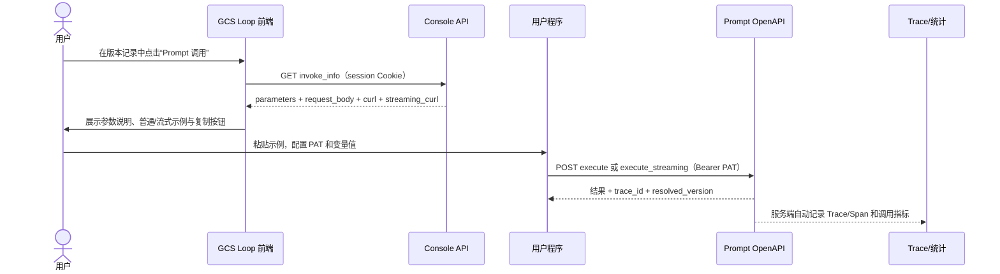

# Prompt 已发布版本 HTTP 调用：前端接入指南

本文定义 GCS Loop 中“版本记录 -> Prompt 调用”的前后端契约。每个已发布版本都由后端返回与该版本变量定义完全对应的 HTTP 请求体和 `curl` 示例；用户复制示例、填写变量并使用 Personal Access Token（PAT）即可调用，不需要安装或接入 SDK。

本能力只面向**已提交版本**。草稿仍用于编辑和调试，不会生成可供外部程序长期依赖的调用示例。

## 1. 接入结论

前端只需要完成两件事：

1. 用户在版本记录中打开某个版本时，使用当前登录会话获取该版本的调用信息。
2. 展示后端返回的参数说明、请求体、普通 `curl` 和流式 `curl`，并提供复制能力。

前端不要自行解析 Prompt 内容来猜测变量，也不要自行拼接 `curl`。后端返回的数据以指定提交版本为准，能避免页面逻辑与真实执行协议不一致。

接口分为两个鉴权域：

| 用途 | 路径 | 鉴权 | 谁调用 |
| --- | --- | --- | --- |
| 获取版本专属调用信息 | `/api/prompt/v1/**` | 登录会话 Cookie | GCS Loop 前端 |
| 实际执行 Prompt | `/v1/loop/prompts/**` | `Authorization: Bearer <PAT>` | 用户自己的服务、脚本或命令行 |

浏览器前端只负责展示示例，不应把 PAT 保存到页面状态、浏览器存储或前端日志中。

## 2. 获取指定版本的调用信息

```http
GET /api/prompt/v1/prompts/{prompt_id}/commits/{commit_version}/invoke_info?workspace_id={workspace_id}
```

### 2.1 参数

| 参数 | 位置 | 类型 | 必填 | 说明 |
| --- | --- | --- | --- | --- |
| `prompt_id` | path | string | 是 | Prompt ID；按字符串处理，避免 JavaScript `number` 精度丢失 |
| `commit_version` | path | string | 是 | 要展示的已提交版本，例如 `1.2.0` |
| `workspace_id` | query | string | 是 | Prompt 所属工作空间 ID；按字符串处理 |

`prompt_id`、`workspace_id` 和 `commit_version` 都应使用 `encodeURIComponent` 构造 URL。该接口使用登录后的 `session_key` Cookie；前后端分域部署时，请求必须设置 `credentials: 'include'`。

前端调用示例：

```ts
const path =
  `/api/prompt/v1/prompts/${encodeURIComponent(promptId)}` +
  `/commits/${encodeURIComponent(version)}/invoke_info` +
  `?workspace_id=${encodeURIComponent(workspaceId)}`;

const response = await fetch(path, {
  method: 'GET',
  credentials: 'include',
});
const result = await response.json();

if (!response.ok || result.code !== 0) {
  throw new Error(result.msg || '获取 Prompt 调用信息失败');
}
```

### 2.2 成功响应

下面为便于阅读省略了 `curl` 和 `streaming_curl` 中重复的完整 body，以 `{...}` 表示；真实响应会把同一个完整 `request_body` 写入两个命令。

```json
{
  "invoke_info": {
    "prompt_key": "bidding_proposal_writing",
    "version": "1.2.0",
    "base_url": "https://gcs.example.com",
    "parameters": [
      {
        "key": "tender_requirements",
        "description": "招标需求与评分标准",
        "type": "string",
        "value_field": "value",
        "example": "请填写：招标需求与评分标准"
      }
    ],
    "execute_endpoint": "/v1/loop/prompts/execute",
    "streaming_execute_endpoint": "/v1/loop/prompts/execute_streaming",
    "request_body": "{\n  \"workspace_id\": \"7670078211023175681\",\n  \"prompt_identifier\": {\n    \"prompt_key\": \"bidding_proposal_writing\",\n    \"version\": \"1.2.0\"\n  },\n  \"variable_vals\": [\n    {\n      \"key\": \"tender_requirements\",\n      \"value\": \"请填写：招标需求与评分标准\"\n    }\n  ]\n}",
    "curl": "curl --request POST \\\n  'https://gcs.example.com/v1/loop/prompts/execute' \\\n  --header \"Authorization: Bearer ${GCS_LOOP_API_TOKEN}\" \\\n  --header \"Content-Type: application/json\" \\\n  --data-binary '{...}'",
    "streaming_curl": "curl --request POST \\\n  'https://gcs.example.com/v1/loop/prompts/execute_streaming' \\\n  --header \"Authorization: Bearer ${GCS_LOOP_API_TOKEN}\" \\\n  --header \"Content-Type: application/json\" \\\n  --header \"Accept: text/event-stream\" \\\n  --no-buffer \\\n  --data-binary '{...}'"
  },
  "code": 0,
  "msg": ""
}
```

字段说明：

| 字段 | 说明 |
| --- | --- |
| `prompt_key` | 公共执行接口使用的 Prompt 唯一标识 |
| `version` | 本次示例固定调用的提交版本 |
| `parameters` | 从该版本 `variable_defs` 生成的参数说明，顺序与后端版本定义一致 |
| `base_url` | 当前部署对用户可访问的 API Origin，例如 `https://gcs.example.com`，不包含 `/v1` 路径 |
| `execute_endpoint` | 非流式执行路径 |
| `streaming_execute_endpoint` | SSE 流式执行路径 |
| `request_body` | 可直接作为 HTTP body 使用的格式化 JSON **字符串** |
| `curl` | 非流式完整命令，多行文本 |
| `streaming_curl` | 流式完整命令，多行文本，已包含 SSE 请求头和 `--no-buffer` |

`request_body`、`curl`、`streaming_curl` 都是字符串。前端展示或复制时直接使用响应值，不要再次 `JSON.stringify`，否则会把换行和引号再转义一层。

`curl` 解码后的形态如下，真实命令中的最后一行是该版本完整的 `request_body`：

```bash
curl --request POST \
  'https://gcs.example.com/v1/loop/prompts/execute' \
  --header "Authorization: Bearer ${GCS_LOOP_API_TOKEN}" \
  --header "Content-Type: application/json" \
  --data-binary '<该版本的完整 request_body>'
```

`streaming_curl` 使用同一份请求体，但路径为 `/v1/loop/prompts/execute_streaming`，并额外包含 `Accept: text/event-stream` 与 `--no-buffer`。

## 3. 动态参数与 `variable_vals`

后端会按指定版本的变量定义生成 `parameters` 和 `request_body.variable_vals`。前端应把 `parameters` 用作说明表，把 `request_body`/`curl` 用作可复制示例；不要从 `parameters` 重新生成请求体。

每个参数包含：

| 字段 | 说明 |
| --- | --- |
| `key` | 变量名，对应 `variable_vals[].key` |
| `description` | Prompt 作者填写的变量说明，可能缺失 |
| `type` | 变量类型 |
| `value_field` | 该变量应使用 `value`、`placeholder_messages` 或 `multi_part_values` 中的哪一个字段 |
| `example` | `value_field` 对应值的示例；结构化值以 JSON 文本给出 |
| `type_tags` | 变量的附加类型约束，主要用于 `multi_part` 的图片、视频等限制；可能缺失 |

### 3.1 普通变量

以下类型都使用 `value_field = "value"`：

| `type` | `variable_vals[].value` 示例 | 说明 |
| --- | --- | --- |
| `string` | `"招标需求正文"` | 直接传文本 |
| `boolean` | `"true"` | 布尔值序列化为字符串 |
| `integer` | `"1"` | 整数序列化为字符串 |
| `float` | `"1.5"` | 浮点数序列化为字符串 |
| `object` | `"{\"industry\":\"IT\"}"` | JSON 对象序列化后放入字符串 |
| `array<string>` | `"[\"材料 A\",\"材料 B\"]"` | JSON 数组序列化后放入字符串 |
| `array<boolean>` | `"[true,false]"` | 同上 |
| `array<integer>` | `"[1,2]"` | 同上 |
| `array<float>` | `"[1.5,2.5]"` | 同上 |
| `array<object>` | `"[{\"name\":\"案例 A\"}]"` | 同上 |

非字符串类型也必须放在 JSON 字段 `value` 的**字符串值**中，不能把对象、数组、数字或布尔值直接作为 `value`。例如：

```json
{
  "key": "customer_profile",
  "value": "{\"industry\":\"IT\",\"employees\":1000}"
}
```

### 3.2 Placeholder 变量

`type = "placeholder"` 使用 `value_field = "placeholder_messages"`，值是消息数组：

```json
{
  "key": "conversation_history",
  "placeholder_messages": [
    {
      "role": "user",
      "content": "上一轮用户输入"
    },
    {
      "role": "assistant",
      "content": "上一轮模型回复"
    }
  ]
}
```

### 3.3 多模态变量

`type = "multi_part"` 使用 `value_field = "multi_part_values"`，值是内容片段数组。前端应展示 `type_tags`，提醒调用方按该版本允许的媒体类型传值。

图片示例：

```json
{
  "key": "reference_image",
  "multi_part_values": [
    {
      "type": "image_url",
      "image_url": "https://example.com/reference.png"
    }
  ]
}
```

视频示例：

```json
{
  "key": "reference_video",
  "multi_part_values": [
    {
      "type": "video_url",
      "video_url": "https://example.com/reference.mp4"
    }
  ]
}
```

若 `type_tags` 为空，后端示例会给出通用内容片段。调用方仍应以当前模型实际支持的媒体格式和大小限制为准。

`parameters` 当前不提供独立的 `required` 标记。生成的请求体会列出该版本定义的全部变量；页面应统一提示用户替换示例值，不要在前端推断某个变量可省略。

## 4. 非流式 HTTP 调用

```http
POST /v1/loop/prompts/execute
Authorization: Bearer <PAT>
Content-Type: application/json
```

实际请求使用 `invoke_info.request_body` 的结构：

```json
{
  "workspace_id": "7670078211023175681",
  "prompt_identifier": {
    "prompt_key": "bidding_proposal_writing",
    "version": "1.2.0"
  },
  "variable_vals": [
    {
      "key": "tender_requirements",
      "value": "请根据以下评分标准撰写方案：……"
    }
  ]
}
```

成功响应示例：

```json
{
  "code": 0,
  "msg": "",
  "data": {
    "message": {
      "role": "assistant",
      "content": "生成结果……"
    },
    "finish_reason": "stop",
    "usage": {
      "input_tokens": 320,
      "output_tokens": 840
    },
    "trace_id": "0af7651916cd43dd8448eb211c80319c",
    "prompt_key": "bidding_proposal_writing",
    "resolved_version": "1.2.0"
  }
}
```

调用方必须同时检查 HTTP 状态和响应体 `code`。`code = 0` 才表示业务成功。

## 5. SSE 流式调用

```http
POST /v1/loop/prompts/execute_streaming
Authorization: Bearer <PAT>
Content-Type: application/json
Accept: text/event-stream
```

请求 body 与非流式接口相同。服务以 Server-Sent Events 返回数据：

```text
event: data
data: {"message":{"role":"assistant","content":"生成"},"trace_id":"0af7651916cd43dd8448eb211c80319c","prompt_key":"bidding_proposal_writing","resolved_version":"1.2.0"}

event: data
data: {"message":{"role":"assistant","content":"结果"},"finish_reason":"stop","usage":{"input_tokens":320,"output_tokens":840},"trace_id":"0af7651916cd43dd8448eb211c80319c","prompt_key":"bidding_proposal_writing","resolved_version":"1.2.0"}
```

流式处理规则：

- 只把 `event: data` 的 `data` 解析为 JSON；每个数据块都是 `ExecuteStreamingData`，不是非流式响应的 `{code,msg,data}` 外层包络。
- 同一次流式调用的所有数据块使用同一个 `trace_id`、`prompt_key` 和 `resolved_version`。
- 按收到的顺序消费 `message` 增量；`usage` 和 `finish_reason` 以服务实际返回的数据块为准。
- 服务端正常关闭连接表示本次流结束，不要依赖自定义 `[DONE]` 文本。
- `event: error` 的 `data` 是错误 JSON；收到后结束本次消费并按业务错误处理。
- 命令行必须使用 `curl --no-buffer`，否则终端可能缓存数据，看起来不像实时输出。

浏览器原生 `EventSource` 只支持 GET，不能直接用于这个带 POST body 和 Authorization header 的接口。用户程序应使用支持 POST SSE 的 HTTP 客户端，或用 `fetch` 读取 `ReadableStream` 并自行解析 SSE 帧。

## 6. Trace 与调用统计

使用上述两个公共执行接口时，服务端会自动创建并记录本次 Prompt 执行的 Trace/Span。用户不需要安装 SDK，也不需要额外调用 Trace 上报接口。

服务端可基于这些执行记录统计调用次数、成功/失败、耗时和 Token 用量等数据。Trace 和统计写入可能存在短暂的异步延迟，执行接口成功不代表统计页面必须在同一毫秒刷新。

响应中的三个字段用于把调用结果与版本、可观测数据关联起来：

| 字段 | 用途 |
| --- | --- |
| `trace_id` | 查询和定位本次服务端执行 Trace；排障时应优先记录 |
| `prompt_key` | 服务端实际解析并执行的 Prompt Key |
| `resolved_version` | 服务端实际执行的提交版本 |

对于版本专属示例，`resolved_version` 正常情况下应等于页面选择的 `invoke_info.version`。若不一致，调用方应保留 `trace_id` 并停止把结果归入当前版本。

通过请求参数校验和目标工作空间权限校验后，调用会进入该工作空间的指标、调用日志与 Trace 采集。参数无效或无权访问目标工作空间的请求不会写入该工作空间的 Trace/统计，避免跨工作空间污染；网关访问日志仍可用于排查这类请求。Prompt 执行不是幂等读取：网络超时后自动重试可能再次调用模型、产生新的 Trace、Token 消耗和结果，调用方应按业务需要决定是否重试。

## 7. 版本固定与更新规则

- 调用信息接口只读取路径指定的已提交版本，不读取当前草稿，也不把“最新版本”隐式替换进示例。
- 生成的 `request_body` 明确包含 `prompt_identifier.version`，因此同一份示例会稳定指向同一版本。
- 新版本发布后，旧版本示例仍指向旧版本；前端不能静默修改用户已经复制的版本号。
- 用户切换版本时，前端必须按新的 `{workspace_id, prompt_id, commit_version}` 重新获取调用信息。
- 如需缓存，只能按上述三元组缓存。版本一旦提交是不可变快照，因此不需要按草稿更新时间使缓存失效；版本删除或权限变化时仍应以最新接口结果为准。
- `parameters`、`request_body` 和两个 `curl` 属于同一次响应快照，前端应整体替换，不能跨版本混用。

## 8. 推荐的前端页面与调用时序



页面建议：

1. 在版本详情或版本记录操作区提供“Prompt 调用”入口。
2. 打开抽屉/弹窗后立即请求该版本的 `invoke_info`，加载期间禁用复制按钮。
3. 参数区展示 `key`、说明、类型、`type_tags` 和 `value_field`；无参数时显示“该版本无需 Prompt 变量”。
4. 示例区提供“非流式”和“流式”两个页签，默认展示后端返回的 `curl` 文本。
5. 可额外提供“请求体”页签，内容直接使用 `request_body`。
6. 复制成功只提示本地 UI 状态，不把复制内容写入分析日志。
7. 接口失败时保留当前版本上下文，展示 `msg` 并允许重试；不要退回到其他版本的旧示例。

## 9. 安全注意事项

- `invoke_info` 使用 session 鉴权，并校验工作空间和 Prompt 读取权限；不能仅因为知道 Prompt ID 和版本就获取内容。
- 公共执行接口只接受 PAT Bearer 鉴权。不要把 session Cookie 当作 PAT，也不要把 PAT 放到 query string。
- 返回的 `base_url` 和两个 `curl` 已包含当前部署的公开访问地址；`curl` 只保留 `${GCS_LOOP_API_TOKEN}` 占位符，不会返回真实 Token。前端不得替用户把真实 PAT 注入示例。
- PAT 应保存在用户服务的 Secret 管理、环境变量或安全凭据存储中，禁止提交到 Git、写入前端 bundle 或粘贴到工单/聊天记录。
- 生产部署应显式设置 `COZE_LOOP_PUBLIC_BASE_URL=https://你的公开域名`。未设置时，简单 Docker Compose 部署会从当前浏览器请求的 Host 推导；Nginx 会保留外部 Host 与端口。多层代理或 TLS 终止场景不要依赖自动推导。
- Prompt 变量可能包含招标文件、客户信息等敏感数据。页面日志、埋点、错误上报和剪贴板提示不得记录完整 `request_body` 或变量值。
- `trace_id` 可用于排障，但不等同于访问凭据。查看 Trace 仍必须通过正常的工作空间权限校验。
- 生产服务应为 PAT 配置最小必要权限和轮换机制；Token 泄漏后应立即撤销。

## 10. 错误处理

前端获取 `invoke_info` 时必须同时检查 HTTP 状态码和响应体业务码：

- `code = 0`：展示响应中的完整调用信息。
- 参数错误：检查三个路径/查询参数是否存在且经过 URL 编码。
- 版本或 Prompt 不存在：关闭复制能力，提示用户刷新版本记录；不能回退到草稿或 latest。
- 工作空间不匹配或无权限：不展示历史缓存中的请求体和 `curl`，并清除当前弹窗数据。
- 网络错误：允许按同一版本重试获取调用信息。该 GET 只读取不可变版本，不会触发模型执行。

对于用户程序调用 `/v1/loop/prompts/execute(_streaming)`：

- `401/403` 或鉴权业务错误：检查 PAT 是否有效、是否有目标工作空间权限。
- Prompt/版本不存在：检查 `prompt_key` 和固定 `version`，不要自动改成 latest。
- 变量渲染错误：依据 `parameters[].value_field` 和类型表检查 `variable_vals`。
- 模型调用错误或超时：记录 `trace_id`（若响应已返回），再决定是否重试；重试可能产生二次费用与调用统计。

## 11. 联调验收清单

- [ ] 每个已提交版本都能独立打开“Prompt 调用”，URL 使用所选 `commit_version`。
- [ ] 草稿没有“可发布调用示例”，也不会被调用信息接口隐式读取。
- [ ] `prompt_id` 和 `workspace_id` 全程按 string 处理，没有 JavaScript 精度丢失。
- [ ] 获取调用信息使用 session Cookie；前后端分域时携带 `credentials: 'include'`。
- [ ] 参数表与该版本变量完全一致，能够展示 `value_field` 和 `type_tags`。
- [ ] 无变量版本返回并展示空参数列表，生成请求体中的 `variable_vals` 为空数组。
- [ ] 普通结构化变量的值以 JSON 字符串放入 `value`，没有错误地传成原生对象、数组、数字或布尔值。
- [ ] `placeholder` 使用 `placeholder_messages`，`multi_part` 使用 `multi_part_values`。
- [ ] 前端直接复制后端返回的 `curl`/`streaming_curl`，没有二次转义或自行重建。
- [ ] 普通示例包含 `/v1/loop/prompts/execute` 和 Bearer PAT 占位符。
- [ ] 流式示例包含 `/v1/loop/prompts/execute_streaming`、`Accept: text/event-stream` 和 `--no-buffer`。
- [ ] 用户替换 PAT 和变量示例值后，普通调用能直接使用返回的公开 Base URL 并得到完整结果。
- [ ] 流式客户端能解析 `event: data`，按顺序显示增量，并在连接正常关闭时结束。
- [ ] 普通响应与每个 SSE 数据块都能读取同一次调用的 `trace_id`、`prompt_key` 和 `resolved_version`。
- [ ] `resolved_version` 与页面所选版本一致。
- [ ] 不接入 SDK 或额外 Trace 上报接口，执行后仍能在服务端看到 Trace 和统计数据。
- [ ] 不同版本的变量定义变化后，重新打开时参数、请求体和两个 `curl` 都随版本变化，旧版本内容不被混入。
- [ ] 无权限、版本不存在或工作空间不匹配时，不继续展示缓存中的敏感调用内容。
- [ ] 页面、埋点和错误日志不记录 PAT、完整变量值或完整请求体。
