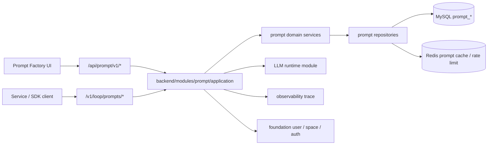

# GCS Loop 提示词工厂架构

> 本文说明 `gcs-loop` 作为 GCS 提示词工厂后端时的架构边界。内容基于当前仓库真实存在的 Coze Loop Prompt 模块，不新增假接口，也不设计平行存储。

## 定位

`gcs-loop` 是 GCS 系列里的提示词工厂后端。第一版能力应覆盖提示词编写、草稿、版本发布、片段复用、工具绑定、调试和运行时调用，并优先复用当前 Coze Loop 的 `prompt` DDD 模块。

产品形态叫“提示词工厂”，后端实现仍然是现有 Prompt 领域。只有出现真实契约缺口时，才新增表、IDL 或应用服务。

## 已有后端能力

当前仓库已经提供这些提示词工厂基础能力：

| 能力 | 已有实现 |
| --- | --- |
| Prompt CRUD | `idl/thrift/coze/loop/prompt/coze.loop.prompt.manage.thrift` 里的 `PromptManageService` |
| 草稿编辑 | `SaveDraft` 和 `PromptDraft` |
| 版本发布 | `CommitDraft`、`ListCommit`、`RevertDraftFromCommit` |
| 版本标签 | `CreateLabel`、`ListLabel`、`UpdateCommitLabels` |
| Prompt 片段 | `PromptType_Snippet`、`ListParentPrompt`、`prompt_relation` |
| Playground 调试 | `PromptDebugService.DebugStreaming` 和 debug context/history API |
| 运行时执行 | `PromptOpenAPIService.Execute` 和 `ExecuteStreaming` |
| 工具定义 | `ToolManageService` 和 `prompt.Tool` |
| 认证与空间 | `foundation` 的 user/session/PAT/space 服务 |
| 可观测性 | prompt execution span 和 debug log |

## 领域模型

前端应把一个 prompt 理解成三层：

| 层 | 关键字段 | UI 含义 |
| --- | --- | --- |
| `PromptBasic` | `display_name`、`description`、`latest_version`、`prompt_type`、`security_level`、`created_by`、`updated_at` | 列表、头部、权限/密级提示 |
| `PromptDraft` | `detail`、`draft_info.base_version`、`draft_info.is_modified` | 当前编辑器状态 |
| `PromptCommit` | `detail`、`commit_info.version`、`commit_info.description`、`commit_info.committed_at` | 已发布版本状态 |

`PromptDetail` 是提示词工厂真正管理的产物：

| 字段 | 含义 |
| --- | --- |
| `prompt_template.template_type` | `normal`、`jinja2`、`go_template`、`custom_template_m` |
| `prompt_template.messages` | 有序的 system/user/assistant/tool/placeholder 消息 |
| `prompt_template.variable_defs` | 调试或执行前 UI 必须收集的变量定义 |
| `prompt_template.metadata` | 模板级可选元数据 |
| `tools` | 绑定到 prompt 的函数或 Google Search 工具 |
| `tool_call_config` | 工具选择策略 |
| `model_config` | 模型、采样、JSON mode、thinking 配置 |
| `mcp_config` | 部署启用 MCP 时的 MCP server 绑定 |
| `ext_infos` | 后续扩展元数据，必须保持 optional |

## 存储

提示词工厂的业务状态必须落到真实基础设施：

| 存储 | 当前用途 |
| --- | --- |
| MySQL | `prompt_basic`、`prompt_user_draft`、`prompt_commit`、`prompt_label`、`prompt_commit_label_mapping`、`prompt_relation`、`prompt_debug_context`、`prompt_debug_log`、`tool_basic`、`tool_commit` |
| Redis | Prompt cache、label-version cache、限流、ID 生成 |
| ClickHouse | Trace 和观测分析 |
| Object Storage | 通过 foundation file service 支持文件与多模态内容 |

生产环境不能把 prompt 数据落到 JSON 文件、本地 mock 数据或内存 fallback。单测可以继续使用已有的 miniredis 和测试 helper。

## GCS 对齐原则

GCS 系列通常使用 `uid`、共享 `ai_market` MySQL、以及 `/storage-root-jfs` 用户目录。Coze Loop 原生使用 `workspace_id` 和 session。提示词工厂第一阶段按以下规则处理：

| 关注点 | 决策 |
| --- | --- |
| 业务隔离 | 使用 `workspace_id`，它已经存在于所有 prompt API 和权限检查里 |
| GCS 用户身份 | 通过登录态/PAT/网关映射到 Coze Loop 用户，不在 prompt 表里新增 `uid` |
| 共享 MySQL | 优先接入同一个 `ai_market` 实例，但表名保持 `prompt_*`、`space*`、`user*`、trace 等既有隔离 |
| 共享 Redis | 可以复用 GCS Redis，key 前缀由现有 Coze Loop 代码负责 |
| 共享存储 | Prompt 文本不需要用户目录；文件上传仍走 object storage/foundation file API |

## 认证模式

两类调用面要分清：

| 调用方 | API 面 | 认证方式 |
| --- | --- | --- |
| Web UI | `/api/prompt/v1/*`、`/api/foundation/v1/*`、`/api/auth/v1/*` | 浏览器 session cookie |
| 外部服务/SDK | `/v1/loop/prompts/*` | Personal Access Token |

UI 编辑器调试应优先使用 web debug API，而不是 OpenAPI execute，因为 web debug 会保存当前用户的 debug context/history。

## 后续扩展点

只有真实需求确认后再新增代码：

| 缺口 | 推荐实现 |
| --- | --- |
| 工厂级分类/市场页 | 先明确产品 schema，再用 optional metadata 或新增表扩展；不破坏 Prompt CRUD |
| GCS SSO | 增加 foundation/session adapter 或反向代理鉴权中间件，不改 prompt 表 |
| 审计集成 | 在现有 `audit.IAuditService` 后面增加真实实现 |
| 密钥管理 | 对 OpenAPI 执行配置增加 secret reference 解析，不把明文密钥写入 prompt metadata |
| Prompt 导入/导出 | 新增明确 API，并通过 object storage 保存导入/导出文件 |

## 第一阶段不做

- 不把 prompt 模块 fork 成新的 `factory` 模块。
- 不在代码或 SQL 里塞演示 prompt 数据。
- 不手改 `backend/kitex_gen`、`backend/loop_gen`、`backend/api/router_gen.go` 或 `wire_gen.go`。
- 不用 `uid` 替换现有 Prompt API 的 `workspace_id`。
